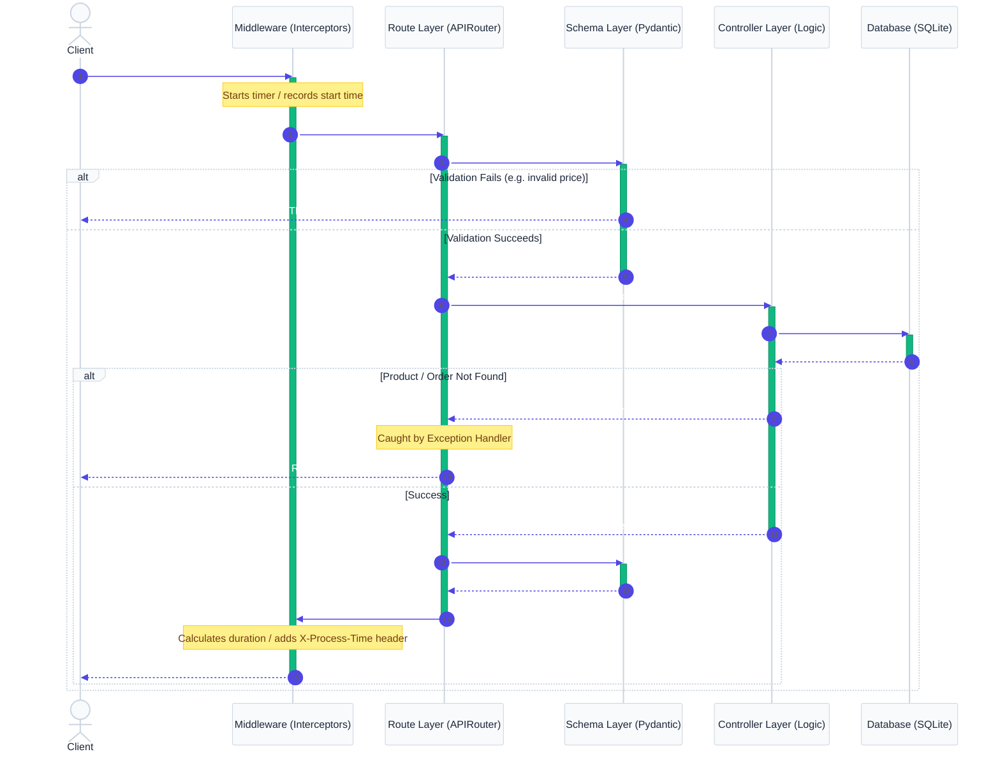

<div align="center">

# E-Commerce API

**A production-grade REST API built with FastAPI — designed for learning professional backend architecture**

[](https://python.org)
[](https://fastapi.tiangolo.com)
[](https://sqlite.org)

<br/>

[Features](#features) • [Quick Start](#quick-start) • [Architecture](#architecture) • [API Reference](#api-reference) • [Project Structure](#project-structure) • [What I Learned](#what-i-learned)

</div>

---

<br/>

## Overview

This is not a tutorial project with everything crammed into one file. This is a **properly architected** FastAPI backend that mirrors how production APIs are built at real companies — just scaled down so every design decision is visible and understandable.

The goal: build a backend that I can revisit after a year and understand the architecture within 15 minutes by reading the code and documentation alone.

<br/>

> [!NOTE]
> This project is actively developed as a phased learning journey. Each phase introduces new backend engineering concepts while keeping the codebase clean and well-documented.

<br/>

---

<br/>

## Features

### Implemented

* **Layered Architecture** — Routes, Controllers, Schemas, and Config cleanly separated
* **Product CRUD** — Create, List, Retrieve, and Delete operations
* **Order CRUD** — Create orders, list all orders, and retrieve a single order by ID with stock deduction
* **User & Admin Registration** — Customer sign-up and secure administrator registration guarded by a registration key
* **JWT Stateless Authentication** — Token generation/decoding using `jose` with secure password hashing using `passlib` (bcrypt)
* **Role-Based Access Control (RBAC)** — Reusable route dependencies enforce customer or admin permissions (`Depends(require_role("admin"))`)
* **Pydantic Validation** — Strict request/response schemas with field-level constraints
* **Internal Schemas** — `ValidatedOrderItem` separates controller-internal data from public API schemas
* **Custom Exception Handling** — Domain exceptions (`ProductNotFoundException`, `ProductOutOfStockException`, `OrderNotFoundException`, `InvalidCredentialsException`, `InvalidTokenException`, `PermissionDeniedException`) with global handlers returning clean JSON errors
* **Request Timing Middleware** — Every response includes an `X-Process-Time` header; execution time is logged to the terminal
* **Environment Configuration** — Secrets (database paths, JWT keys, registration keys) loaded from `.env`, never hardcoded
* **Auto-generated API Docs** — Swagger UI and ReDoc available out of the box
* **Database Auto-setup** — Tables created automatically on first startup

<br/>

### Planned

* Product Update operation and pagination
* Migration from raw SQL to SQLAlchemy + Alembic
* Automated testing with pytest
* AI/RAG integration for product search

<br/>

---

<br/>

## Quick Start

### Prerequisites

* Python 3.11 or higher
* Git

<br/>

### Setup

```bash
# Clone the repository
git clone https://github.com/nakul-cloud/ecommerce-api.git
cd ecommerce-api

# Create and activate virtual environment
python -m venv .venv

# Windows (PowerShell)
.venv\Scripts\Activate.ps1

# macOS / Linux
source .venv/bin/activate

# Install dependencies
pip install fastapi uvicorn python-dotenv python-jose passlib bcrypt
```

<br/>

### Run

```bash
uvicorn app.main:app --reload
```

The API starts at **http://127.0.0.1:8000**

<br/>

### Try it

```bash
# Create a product
curl -X POST http://127.0.0.1:8000/products \
  -H "Content-Type: application/json" \
  -d '{
    "name": "Wireless Mouse",
    "description": "Ergonomic wireless mouse with USB receiver",
    "category": "Electronics",
    "price": 29.99,
    "stock_quantity": 150,
    "cost_price": 12.50
  }'
```

**Response** (201 Created):

```json
{
  "id": 1,
  "name": "Wireless Mouse",
  "description": "Ergonomic wireless mouse with USB receiver",
  "category": "Electronics",
  "price": 29.99,
  "stock_quantity": 150
}
```

<br/>

> [!TIP]
> Notice that `cost_price` is **not** in the response. The `ProductResponse` schema intentionally hides internal pricing from API consumers. This is a real-world pattern — you never expose your margins to customers.

<br/>

---

<br/>

## Architecture

### Request Lifecycle

Every API request flows through these layers in order. Each layer has exactly one job.



<br/>

### Design Decisions

| Decision | Why |
|---|---|
| **Separate routes from controllers** | Routes define *what* endpoints exist. Controllers define *what happens*. This makes business logic reusable and testable without HTTP. |
| **Input schema ≠ Response schema** | `ProductCreate` accepts `cost_price`. `ProductResponse` hides it. The API never exposes internal data. |
| **Internal schemas for controller data** | `ValidatedOrderItem` carries `unit_price` between validation and insert logic — it is never part of the public API. Keeps the controller readable without polluting `order_schema.py`. |
| **Custom exceptions over HTTP exceptions** | Controllers raise `ProductNotFoundException` — they don't know about HTTP status codes. The global handler translates it to `404`. Clean separation. |
| **Dependency injection for auth** | `get_current_user` and `require_role` are reusable FastAPI `Depends()` dependencies. Wires up stateless JWT checks and role enforcement in one line. |
| **`CREATE TABLE IF NOT EXISTS`** | Startup runs every time. Without `IF NOT EXISTS`, the second startup would crash. |
| **`.env` for configuration** | Same code runs in dev, staging, and production. Only the `.env` file changes. |

<br/>

---

<br/>

## API Reference

### Interactive Documentation

| URL | Description |
|---|---|
| http://127.0.0.1:8000/docs | **Swagger UI** — interactive, test endpoints directly |
| http://127.0.0.1:8000/redoc | **ReDoc** — clean read-only documentation |

<br/>

### Authentication

Protected routes require a Bearer token in the `Authorization` header:

```bash
curl -H "Authorization: Bearer <your-jwt-token>" ...
```

You can obtain the JWT access token by sending a POST request to `/auth/login` with your credentials (`username` as email, `password`).

<br/>

### Endpoints

#### Authentication & Users

| Method | Endpoint | Auth | Description | Status Code |
|---|---|---|---|---|
| `GET` | `/` | — | Health check | `200` |
| `POST` | `/auth/login` | — | Login user, return JWT bearer access token | `200` |
| `POST` | `/users/register` | — | Register a new customer | `201` |
| `POST` | `/users/register-admin` | — | Register a new admin (requires `admin_key` in body) | `201` |

#### Products

| Method | Endpoint | Auth | Description | Status Code |
|---|---|---|---|---|
| `POST` | `/products` | ✅ Admin Role | Create a new product (Admin Only) | `201` |
| `GET` | `/products` | — | List all products | `200` |
| `GET` | `/products/{product_id}` | — | Retrieve a single product by ID | `200` |
| `DELETE` | `/products/{product_id}` | ✅ Admin Role | Delete a product by ID (Admin Only) | `200` |

#### Orders

| Method | Endpoint | Auth | Description | Status Code |
|---|---|---|---|---|
| `POST` | `/orders` | ✅ User (Any) | Create a new customer order | `201` |
| `GET` | `/orders` | ✅ User (Any) | List all customer orders | `200` |
| `GET` | `/orders/{order_id}` | ✅ User (Any) | Retrieve a single order by ID | `200` |

<br/>

### Error Responses

When something goes wrong, the API returns structured JSON errors:

```json
{
  "status": "error",
  "message": "Invalid or expired access token."
}
```

| Status Code | When |
|---|---|
| `401` | Missing/expired JWT access token, or invalid login credentials |
| `403` | User does not have permission (e.g. customer hitting admin endpoints) |
| `404` | Product or Order not found |
| `409` | Database conflict (e.g. product out of stock during order validation) |
| `422` | Validation failed (missing fields, invalid email format, types violated) |
| `500` | Unexpected server error |

<br/>

---

<br/>

## Project Structure

Navigate to any sub-directory link below to view its specific, in-depth documentation detailing module flows, design decisions, and common interview questions.

```
ecommerce-api/
├── app/                          # Application package (Core Code)
│   ├── main.py                   # FastAPI app, startup, router wiring
│   ├── config/                   # Configuration settings & DB connections
│   ├── auth/                     # JWT Authentication & authorization guards
│   ├── routes/                   # API Route endpoints & HTTP validation
│   ├── controllers/              # Core business & transaction logic
│   ├── schemas/                  # Pydantic input/output schemas
│   ├── exceptions/               # Domain-specific exceptions & handlers
│   └── middleware/               # HTTP timing interceptors
├── data/                         # SQLite binary database files
└── tests/                        # Automated unit & integration tests
```

### Module Documentation Directory

* 📂 **Core Application Setup** — [`app/README.md`](file:///d:/ecommerce-api/app/README.md)
* 📂 **Configuration & Database Connections** — [`app/config/README.md`](file:///d:/ecommerce-api/app/config/README.md)
* 📂 **Authentication, JWT & Authorization Guards** — [`app/auth/README.md`](file:///d:/ecommerce-api/app/auth/README.md)
* 📂 **API Route Descriptors & Path Resolvers** — [`app/routes/README.md`](file:///d:/ecommerce-api/app/routes/README.md)
* 📂 **Business Controllers & DB Operations** — [`app/controllers/README.md`](file:///d:/ecommerce-api/app/controllers/README.md)
* 📂 **Pydantic Validation & Output Formatting Schemas** — [`app/schemas/README.md`](file:///d:/ecommerce-api/app/schemas/README.md)
* 📂 **Custom Exceptions & Global Handlers** — [`app/exceptions/README.md`](file:///d:/ecommerce-api/app/exceptions/README.md)
* 📂 **Timing & Logger Middleware** — [`app/middleware/README.md`](file:///d:/ecommerce-api/app/middleware/README.md)
* 📂 **Database Storage Files** — [`data/README.md`](file:///d:/ecommerce-api/data/README.md)
* 📂 **Automated Test Suites** — [`tests/README.md`](file:///d:/ecommerce-api/tests/README.md)

<br/>

---

<br/>

## Tech Stack

| Technology | Role | Why This Choice |
|---|---|---|
| **Python 3.11+** | Language | Industry standard for backend + AI/ML |
| **FastAPI** | Web framework | Auto-validation, auto-docs, async-ready, type hints |
| **Uvicorn** | ASGI server | Runs FastAPI applications |
| **SQLite** | Database | Zero-config, file-based — perfect for learning, swap to PostgreSQL later |
| **Pydantic** | Validation | Catches bad input before your code runs |
| **python-dotenv** | Configuration | Loads secrets from `.env` so they never touch source code |
| **passlib[bcrypt]** | Security | Standard password hashing library to secure credentials |
| **python-jose** | Tokens | Python implementation of JOSE (JSON Object Signing and Encryption) to generate and verify JWTs |

<br/>

---

<br/>

## Roadmap

| Phase | Focus | Status |
|---|---|---|
| **Phase 1** | Project structure, FastAPI setup, SQLite, Product CRUD, Schemas, Custom Exceptions | ✅ Done |
| **Phase 2** | Order CRUD with stock deduction, Internal schemas, Request timing middleware, `OrderNotFoundException` | ✅ Done |
| **Phase 3** | JWT stateless authentication (Bcrypt, token encoding/decoding), User & Admin registration, Role-Based Access Control (RBAC) | ✅ Done |
| **Phase 4** | Product Update operation, Pagination for list endpoints | 🔜 Planned |
| **Phase 5** | SQLAlchemy ORM, Repository pattern, Alembic migrations | 🔜 Planned |
| **Phase 6** | Automated testing with pytest, Test fixtures | 🔜 Planned |
| **Phase 7** | AI/RAG integration — product search with embeddings | 🔜 Planned |

<br/>

---

<br/>

## What I Learned

Building this project taught me patterns that tutorials rarely cover:

1. **`CREATE TABLE IF NOT EXISTS` does not update existing tables.** If you add a column to your schema definition but the table already exists in SQLite, the change is silently ignored. You must drop and recreate (or use migrations in production).

2. **Pydantic validates before your code runs.** If someone sends `price: -100`, FastAPI returns `422` before `create_product()` is ever called. Your business logic never sees bad data.

3. **Response schemas are security filters.** `ProductCreate` accepts `cost_price`, but `ProductResponse` excludes it. API consumers never see your cost data.

4. **Controllers should not know about HTTP.** A controller raises `ProductNotFoundException`. It has no idea that this becomes a `404` response. The exception handler does that translation. This is real separation of concerns.

5. **Always close database connections before raising exceptions.** Forgetting `conn.close()` before `raise` leaks connections. SQLite has limited concurrency — leaked connections cause the app to hang.

6. **`__init__.py` makes folders importable.** Without it, `from app.config.settings import ...` throws `ModuleNotFoundError`. It looks empty but it's essential.

7. **Internal schemas keep controller logic clean.** `ValidatedOrderItem` carries `unit_price` from the product validation loop to the order-items insert loop. Without it, you'd carry raw dicts and lose type safety — or add `unit_price` to the public `OrderItem` schema, leaking internal pricing logic into the API contract.

8. **One order, many order items.** A single `POST /orders` request inserts one row into `orders` and one row per product into `order_items`. This one-to-many relationship is why the database has three tables and the controller loops twice.

9. **Middleware runs once for every request.** Measuring time inside every route handler would be copy-paste. One `@app.middleware("http")` block with `time.perf_counter()` measures all requests automatically and adds the `X-Process-Time` response header without touching any route function.

10. **Dependency injection is reusable auth.** `Depends(get_current_user)` and `Depends(require_role("admin"))` added to route handlers enforce JWT validation and role requirements without duplicating logic. Adding permission guards is as simple as a single decorator parameter.

11. **Bcrypt hashing is one-way security.** We never store plain passwords. Bcrypt cryptographically hashes passwords with a random salt. Even if the database is leaked, raw passwords cannot be decrypted. During login, we verify credentials by applying the salt to the login password and checking if the resulting hash matches.

12. **JWT verification makes the API stateless.** Instead of maintaining active sessions on the server (stateful), we encrypt the user's identity and permissions into a signed JSON Web Token (JWT) on login. On subsequent requests, the server validates the cryptographic signature of the token using `SECRET_KEY`, authenticating the request securely without any session database reads.

<br/>

---

<br/>

## Troubleshooting

### `sqlite3.OperationalError: table has no column named X`

The table was created with an older schema. `CREATE TABLE IF NOT EXISTS` won't update it.

**Fix:** Delete `data/ecommerce.db` and restart the server. Tables will be recreated with the current schema.

<br/>

### `ModuleNotFoundError: No module named 'dotenv'`

Dependencies are not installed in your virtual environment.

**Fix:** Activate your `.venv` and run `pip install python-dotenv`.

<br/>

### `UnicodeEncodeError` on Windows terminal

Windows console may not support Unicode characters (like emojis) in print statements.

**Fix:** Avoid emoji characters in `print()` statements, or set `PYTHONIOENCODING=utf-8`.
