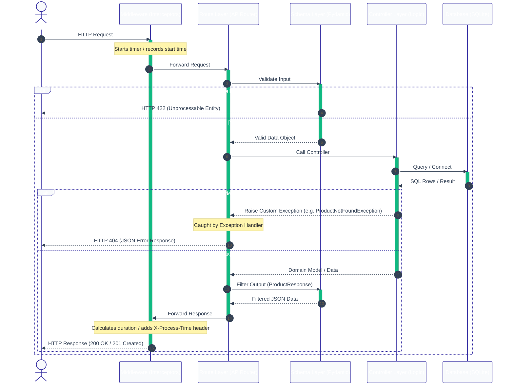

<div align="center">

# E-Commerce API

**A production-grade REST API built with FastAPI — designed for learning professional backend architecture**

[](https://python.org)
[](https://fastapi.tiangolo.com)
[](https://sqlite.org)

[Features](#features) • [Quick Start](#quick-start) • [Architecture](#architecture) • [API Reference](#api-reference) • [Project Structure](#project-structure) • [What I Learned](#what-i-learned)

</div>

---

## Overview

This is not a tutorial project with everything crammed into one file. This is a **properly architected** FastAPI backend that mirrors how production APIs are built at real companies — just scaled down so every design decision is visible and understandable.

The goal: build a backend that I can revisit after a year and understand the architecture within 15 minutes by reading the code and documentation alone.

> [!NOTE]
> This project is actively developed as a phased learning journey. Each phase introduces new backend engineering concepts while keeping the codebase clean and well-documented.

## Features

### Implemented

- **Layered Architecture** — Routes, Controllers, Schemas, and Config cleanly separated
- **Product CRUD** — Create, List, Retrieve, and Delete operations
- **Order CRUD** — Create orders, list all orders, and retrieve a single order by ID with stock deduction
- **Pydantic Validation** — Strict request/response schemas with field-level constraints
- **Internal Schemas** — `ValidatedOrderItem` separates controller-internal data from public API schemas
- **Custom Exception Handling** — Domain exceptions (`ProductNotFoundException`, `ProductOutOfStockException`, `OrderNotFoundException`) with global handlers returning clean JSON errors
- **Admin API Key Auth** — Route-level `X-Api-Key` header dependency guards write operations
- **Request Timing Middleware** — Every response includes an `X-Process-Time` header; execution time is logged to the terminal
- **Environment Configuration** — Secrets loaded from `.env`, never hardcoded
- **Auto-generated API Docs** — Swagger UI and ReDoc available out of the box
- **Database Auto-setup** — Tables created automatically on first startup

### Planned

- Product Update operation
- JWT authentication and role-based access
- Migration from raw SQL to SQLAlchemy + Alembic
- Automated testing with pytest
- AI/RAG integration for product search

## Quick Start

### Prerequisites

- Python 3.11 or higher
- Git

### Setup

```bash
# Clone the repository
git clone https://github.com/nakul-cloud/ecommerce-api.git
cd ecommerce-api

# Create and activate virtual environment
python -m venv .venv

# Windows (PowerShell)
.venv\Scripts\Activate.ps1

# macOS / Linux
source .venv/bin/activate

# Install dependencies
pip install fastapi uvicorn python-dotenv
```

### Run

```bash
uvicorn app.main:app --reload
```

The API starts at **http://127.0.0.1:8000**

### Try it

```bash
# Create a product
curl -X POST http://127.0.0.1:8000/products \
  -H "Content-Type: application/json" \
  -d '{
    "name": "Wireless Mouse",
    "description": "Ergonomic wireless mouse with USB receiver",
    "category": "Electronics",
    "price": 29.99,
    "stock_quantity": 150,
    "cost_price": 12.50
  }'
```

**Response** (201 Created):

```json
{
  "id": 1,
  "name": "Wireless Mouse",
  "description": "Ergonomic wireless mouse with USB receiver",
  "category": "Electronics",
  "price": 29.99,
  "stock_quantity": 150
}
```

> [!TIP]
> Notice that `cost_price` is **not** in the response. The `ProductResponse` schema intentionally hides internal pricing from API consumers. This is a real-world pattern — you never expose your margins to customers.

## Architecture

### Request Lifecycle

Every API request flows through these layers in order. Each layer has exactly one job.



### Design Decisions

| Decision | Why |
|---|---|
| **Separate routes from controllers** | Routes define *what* endpoints exist. Controllers define *what happens*. This makes business logic reusable and testable without HTTP. |
| **Input schema ≠ Response schema** | `ProductCreate` accepts `cost_price`. `ProductResponse` hides it. The API never exposes internal data. |
| **Internal schemas for controller data** | `ValidatedOrderItem` carries `unit_price` between validation and insert logic — it is never part of the public API. Keeps the controller readable without polluting `order_schema.py`. |
| **Custom exceptions over HTTP exceptions** | Controllers raise `ProductNotFoundException` — they don't know about HTTP status codes. The global handler translates it to `404`. Clean separation. |
| **Dependency injection for auth** | `verify_admin_api_key` is a reusable FastAPI `Depends()` function. Adding auth to a new route is one line. Removing it is one line. |
| **`CREATE TABLE IF NOT EXISTS`** | Startup runs every time. Without `IF NOT EXISTS`, the second startup would crash. |
| **`.env` for configuration** | Same code runs in dev, staging, and production. Only the `.env` file changes. |

## API Reference

### Interactive Documentation

| URL | Description |
|---|---|
| http://127.0.0.1:8000/docs | **Swagger UI** — interactive, test endpoints directly |
| http://127.0.0.1:8000/redoc | **ReDoc** — clean read-only documentation |

### Authentication

Protected routes require an `X-Api-Key` header:

```bash
curl -H "X-Api-Key: your-api-key" ...
```

The key is configured in your `.env` file via `ADMIN_API_KEY`.

### Endpoints

#### Products

| Method | Endpoint | Auth | Description | Status Code |
|---|---|---|---|---|
| `GET` | `/` | — | Health check | `200` |
| `POST` | `/products` | ✅ Required | Create a new product | `201` |
| `GET` | `/products` | ✅ Required | List all products | `200` |
| `GET` | `/products/{product_id}` | — | Retrieve a single product | `200` |
| `DELETE` | `/products/{product_id}` | — | Delete a product | `200` |

#### Orders

| Method | Endpoint | Auth | Description | Status Code |
|---|---|---|---|---|
| `POST` | `/orders` | ✅ Required | Create a new order (validates stock, deducts inventory) | `201` |
| `GET` | `/orders` | — | List all orders | `200` |
| `GET` | `/orders/{order_id}` | — | Retrieve a single order by ID | `200` |

### Error Responses

When something goes wrong, the API returns structured JSON errors:

```json
{
  "status": "error",
  "message": "Product with ID 99 not found"
}
```

| Status Code | When |
|---|---|
| `401` | Missing or invalid `X-Api-Key` header |
| `404` | Product or Order not found |
| `422` | Validation failed (missing fields, invalid types, constraints violated) |
| `500` | Unexpected server error |

## Project Structure

```
ecommerce-api/
├── app/                          # Application package
│   ├── main.py                   # FastAPI app, startup, router wiring
│   ├── config/
│   │   ├── settings.py           # Environment variables (.env loader)
│   │   ├── database.py           # SQLite connection + table creation
│   │   └── dependencies.py       # FastAPI dependency: verify_admin_api_key
│   ├── routes/
│   │   ├── products.py           # /products endpoint definitions + admin auth
│   │   └── orders.py             # /orders endpoint definitions
│   ├── controllers/
│   │   ├── product_controller.py # Product business logic + DB operations
│   │   └── order_controller.py   # Order logic: create, list, get by ID
│   ├── schemas/
│   │   ├── product_schema.py     # ProductCreate, ProductUpdate, ProductResponse
│   │   ├── order_schema.py       # OrderItem, OrderCreate, OrderResponse
│   │   └── internal_schemas.py   # ValidatedOrderItem (controller-internal only)
│   ├── exceptions/
│   │   ├── custom_exceptions.py  # ProductNotFoundException, ProductOutOfStockException, OrderNotFoundException
│   │   └── handlers.py           # Global exception → JSON response mapping
│   ├── middleware/
│   │   └── timing.py             # Request timing — logs duration, adds X-Process-Time header
│   └── utils/
│       ├── constants.py          # App-wide constants
│       └── helpers.py            # Reusable helper functions
├── data/
│   └── ecommerce.db              # SQLite database (auto-created)
├── tests/                        # Test suite (coming soon)
├── .env                          # Environment secrets (not committed)
├── .gitignore                    # Git ignore rules
└── requirements.txt              # Python dependencies
```

> [!IMPORTANT]
> Every folder contains its own `README.md` with detailed explanations of purpose, responsibilities, request flow, best practices, and interview questions. Navigate into any folder to learn more.

## Tech Stack

| Technology | Role | Why This Choice |
|---|---|---|
| **Python 3.11+** | Language | Industry standard for backend + AI/ML |
| **FastAPI** | Web framework | Auto-validation, auto-docs, async-ready, type hints |
| **Uvicorn** | ASGI server | Runs FastAPI applications |
| **SQLite** | Database | Zero-config, file-based — perfect for learning, swap to PostgreSQL later |
| **Pydantic** | Validation | Catches bad input before your code runs |
| **python-dotenv** | Configuration | Loads secrets from `.env` so they never touch source code |

## Roadmap

| Phase | Focus | Status |
|---|---|---|
| **Phase 1** | Project structure, FastAPI setup, SQLite, Product CRUD, Schemas, Custom Exceptions | ✅ Done |
| **Phase 2** | Order CRUD with stock deduction, Internal schemas, Admin API Key auth, Request timing middleware, `OrderNotFoundException` | ✅ Done |
| **Phase 3** | Product Update operation, Pagination for list endpoints | 🔜 Planned |
| **Phase 4** | SQLAlchemy ORM, Repository pattern, Alembic migrations | 🔜 Planned |
| **Phase 5** | JWT authentication, Role-based access, Rate limiting | 🔜 Planned |
| **Phase 6** | Automated testing with pytest, Test fixtures | 🔜 Planned |
| **Phase 7** | AI/RAG integration — product search with embeddings | 🔜 Planned |

## What I Learned

Building this project taught me patterns that tutorials rarely cover:

1. **`CREATE TABLE IF NOT EXISTS` does not update existing tables.** If you add a column to your schema definition but the table already exists in SQLite, the change is silently ignored. You must drop and recreate (or use migrations in production).

2. **Pydantic validates before your code runs.** If someone sends `price: -100`, FastAPI returns `422` before `create_product()` is ever called. Your business logic never sees bad data.

3. **Response schemas are security filters.** `ProductCreate` accepts `cost_price`, but `ProductResponse` excludes it. API consumers never see your cost data.

4. **Controllers should not know about HTTP.** A controller raises `ProductNotFoundException`. It has no idea that this becomes a `404` response. The exception handler does that translation. This is real separation of concerns.

5. **Always close database connections before raising exceptions.** Forgetting `conn.close()` before `raise` leaks connections. SQLite has limited concurrency — leaked connections cause the app to hang.

6. **`__init__.py` makes folders importable.** Without it, `from app.config.settings import ...` throws `ModuleNotFoundError`. It looks empty but it's essential.

7. **Internal schemas keep controller logic clean.** `ValidatedOrderItem` carries `unit_price` from the product validation loop to the order-items insert loop. Without it, you'd carry raw dicts and lose type safety — or add `unit_price` to the public `OrderItem` schema, leaking internal pricing logic into the API contract.

8. **One order, many order items.** A single `POST /orders` request inserts one row into `orders` and one row per product into `order_items`. This one-to-many relationship is why the database has three tables and the controller loops twice.

9. **Middleware runs once for every request.** Measuring time inside every route handler would be copy-paste. One `@app.middleware("http")` block with `time.perf_counter()` measures all requests automatically and adds the `X-Process-Time` response header without touching any route function.

10. **Dependency injection is reusable auth.** `Depends(verify_admin_api_key)` added to a route decorator enforces header-based auth without duplicating validation code. Adding it to a new route is a single line.

## Troubleshooting

### `sqlite3.OperationalError: table has no column named X`

The table was created with an older schema. `CREATE TABLE IF NOT EXISTS` won't update it.

**Fix:** Delete `data/ecommerce.db` and restart the server. Tables will be recreated with the current schema.

### `ModuleNotFoundError: No module named 'dotenv'`

Dependencies are not installed in your virtual environment.

**Fix:** Activate your `.venv` and run `pip install python-dotenv`.

### `UnicodeEncodeError` on Windows terminal

Windows console may not support Unicode characters (like emojis) in print statements.

**Fix:** Avoid emoji characters in `print()` statements, or set `PYTHONIOENCODING=utf-8`.
