# `app/` — Application Package

> The entire API lives here. Every subfolder has exactly one responsibility.

## Overview

In professional backend engineering, you never put everything in one file. The `app/` package organizes code by responsibility so that adding a new feature means adding files to the right folders — not scrolling through a 2000-line `main.py`.

## How It Works

```
app/
├── main.py              Entry point — creates the app, wires routers, registers handlers
├── config/              Settings, database connection, and route dependencies
├── routes/              HTTP endpoint definitions (URL → handler mapping)
├── controllers/         Business logic and database operations
├── schemas/             Pydantic models for validation (public API and internal)
├── exceptions/          Custom exceptions and global error handlers
├── middleware/           Request/response interceptors (timing, CORS)
└── utils/               Shared helper functions and constants
```

## Request Flow

When a request hits the API, it flows through these layers:

```mermaid
%%{init: {'theme': 'base', 'themeVariables': {'primaryColor': '#4f46e5', 'primaryTextColor': '#ffffff', 'primaryBorderColor': '#3730a3', 'lineColor': '#94a3b8', 'secondaryColor': '#10b981', 'tertiaryColor': '#f59e0b', 'background': '#ffffff', 'mainBkg': '#f8fafc', 'nodeBorder': '#cbd5e1', 'nodeTextColor': '#1e293b', 'textColor': '#1e293b', 'titleColor': '#1e293b', 'edgeLabelBackground': '#ffffff', 'clusterBkg': '#f1f5f9', 'clusterBorder': '#e2e8f0', 'actorBkg': '#f8fafc', 'actorBorder': '#cbd5e1', 'actorTextColor': '#1e293b', 'signalColor': '#4f46e5', 'signalTextColor': '#1e293b', 'noteBkgColor': '#fef08a', 'noteBorderColor': '#facc15', 'noteTextColor': '#713f12'}}}%%
flowchart LR
    Client([Client]) --> Middleware[Middleware]
    Middleware --> Route[Route]
    Route --> Schema[Schema]
    Schema --> Controller[Controller]
    Controller --> DB[(Database)]
    DB --> Controller
    Controller --> Schema
    Schema --> Route
    Route --> Middleware
    Middleware --> Client
    
    style Middleware fill:#4f46e5,stroke:#3730a3,color:#ffffff
    style Route fill:#4f46e5,stroke:#3730a3,color:#ffffff
    style Schema fill:#4f46e5,stroke:#3730a3,color:#ffffff
    style Controller fill:#4f46e5,stroke:#3730a3,color:#ffffff
```



If a business error occurs (e.g. product not found), the controller raises a custom exception. The global exception handler intercepts it and returns a clean JSON error response.

## Files

### `__init__.py`

Makes `app/` a Python package. Without this file, `from app.config.settings import APP_NAME` would fail with `ModuleNotFoundError`. It's empty, but essential.

### `main.py`

The wiring diagram of the entire application. It does four things:

1. Creates the FastAPI instance with settings from `.env`
2. Registers global exception handlers
3. Creates database tables on startup
4. Connects route modules to the app

> [!TIP]
> `main.py` should stay short. If it's longer than 50 lines, logic that belongs in a controller or middleware has leaked in.

## Real-World Analogy

Think of `app/` as a **hospital**:

| Folder | Hospital Equivalent |
|---|---|
| `main.py` | The building itself |
| `config/` | Power supply and medical records system |
| `routes/` | Reception desk — directs patients |
| `controllers/` | Doctors — diagnose and treat |
| `schemas/` | Intake forms — verify patient information |
| `exceptions/` | Emergency protocols — handle when things go wrong |
| `middleware/` | Security checkpoint at the entrance |
| `utils/` | Shared medical instruments |

## Best Practices

**Do:**
- Keep `main.py` minimal — wiring only
- Import with full paths: `from app.config.settings import APP_NAME`
- Create `__init__.py` in every sub-package

**Don't:**
- Put database queries in `main.py`
- Put route decorators in controllers
- Put business logic in schemas

## 30-Second Revision

- `app/` is the main Python package — all application code lives here
- `main.py` creates the FastAPI app, registers handlers, connects routers
- Each sub-package has one responsibility (Single Responsibility Principle)
- `__init__.py` is empty but must exist for Python imports to work
- Request flows: Client → Middleware → Route → Schema → Controller → Database → Response
