# `app/` — Application Package

> The entire API lives here. Every subfolder has exactly one responsibility.

## Overview

In professional backend engineering, you never put everything in one file. The `app/` package organizes code by responsibility so that adding a new feature means adding files to the right folders — not scrolling through a 2000-line `main.py`.

## How It Works

```
app/
├── main.py              Entry point — lifespan configurations, CORS, GZip, rate-limiting
├── config/              Settings validation (pydantic-settings), SQLite connections
├── auth/                User authentication and role dependencies bridging
├── routes/              Thin HTTP route mappings (URL → controller delegation)
├── controllers/         Static class orchestrators matching REST patterns
├── services/            Database query execution and SQLite transaction controls
├── schemas/             Data schemas & validation (casing/whitespace trimming)
├── exceptions/          Unified exceptions & global handler interceptors
├── middleware/          Modular timing, security headers, and rate limiting files
├── seed/                Database seeders
└── utils/               Shared utility files (PyJWT, logger, responses, validators)
```

## Request Flow

When a request hits the API, it flows through these layers:

```mermaid
%%{init: {'theme': 'base', 'themeVariables': {'primaryColor': '#4f46e5', 'primaryTextColor': '#1e293b', 'primaryBorderColor': '#3730a3', 'lineColor': '#94a3b8', 'secondaryColor': '#10b981', 'tertiaryColor': '#f59e0b', 'background': '#ffffff', 'mainBkg': '#f8fafc', 'nodeBorder': '#cbd5e1', 'nodeTextColor': '#1e293b', 'textColor': '#ffffff', 'titleColor': '#ffffff', 'edgeLabelBackground': '#1e293b', 'clusterBkg': '#f1f5f9', 'clusterBorder': '#e2e8f0', 'actorBkg': '#f8fafc', 'actorBorder': '#cbd5e1', 'actorTextColor': '#1e293b', 'signalColor': '#4f46e5', 'signalTextColor': '#ffffff', 'noteBkgColor': '#fef08a', 'noteBorderColor': '#facc15', 'noteTextColor': '#713f12'}}}%%
flowchart LR
    Client([Client]) --> Middleware[Middleware]
    Middleware --> Route[Route]
    Route --> Schema[Schema]
    Schema --> Controller[Controller]
    Controller --> Service[Service]
    Service --> DB[(Database)]
    DB --> Service
    Service --> Controller
    Controller --> Schema
    Schema --> Route
    Route --> Middleware
    Middleware --> Client
    
    style Middleware fill:#4f46e5,stroke:#3730a3,color:#ffffff
    style Route fill:#4f46e5,stroke:#3730a3,color:#ffffff
    style Schema fill:#4f46e5,stroke:#3730a3,color:#ffffff
    style Controller fill:#4f46e5,stroke:#3730a3,color:#ffffff
    style Service fill:#f59e0b,stroke:#d97706,color:#ffffff
```



If an error occurs (e.g. product not found or out of stock), the service raises a custom exception. The global exception handler intercepts it and returns a clean JSON error response, stopping execution safely.

## Files

### `__init__.py`

Makes `app/` a Python package. Without this file, imports would fail with `ModuleNotFoundError`. It's empty, but essential.

### `main.py`

The wiring diagram of the entire application. It does four things:

1. Creates the FastAPI instance with validated settings.
2. Registers global exception handlers.
3. Sets up lifespans checking database status on startup.
4. Mounts GZip, CORS, SlowAPI rate limiting, and secure response headers.
5. Connects route modules to the app.

---

## Real-World Analogy

Think of `app/` as a **hospital**:

| Folder | Hospital Equivalent |
|---|---|
| `main.py` | The building itself |
| `config/` | Power supply and medical records database config |
| `auth/` | ID badges and security clearances |
| `routes/` | Reception desk — directs patients |
| `controllers/` | Head Nurse — coordinates operations and packs files |
| `services/` | Surgeons / Doctors — execute queries and modify records |
| `schemas/` | Intake forms — verify patient information |
| `exceptions/` | Emergency protocols — handle when things go wrong |
| `middleware/` | Security checkpoint at the main entrance |
| `seed/` | Training simulator — loads the database with realistic demo records |
| `utils/` | Shared medical instruments (e.g. scalpels, thermometers) |

---

## Best Practices

**Do:**
- Keep `main.py` minimal — wiring only.
- Import with full paths: `from app.config.settings import APP_NAME`.
- Create `__init__.py` in every sub-package.

**Don't:**
- Put database queries or transaction commits in controllers or routes.
- Put route decorators in controllers.
- Put business logic in schemas.
