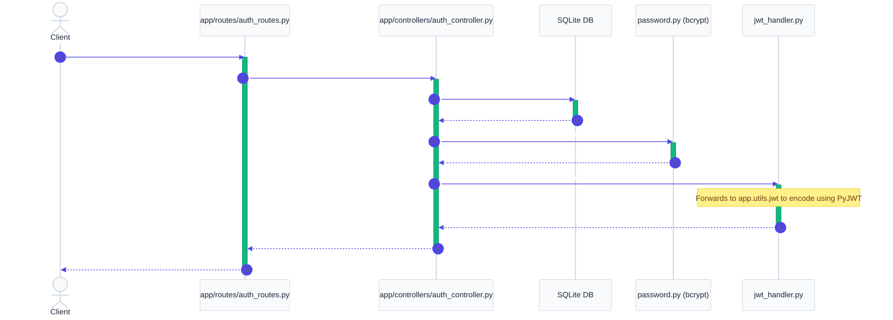
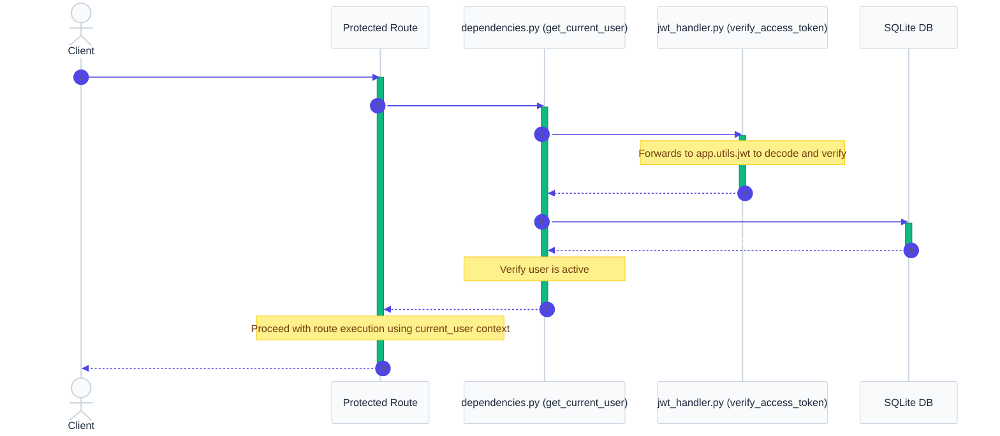

# `app/auth/` — Authentication & Authorization Layer

> Handles user authentication, password hashing, JWT generation, and Role-Based Access Control (RBAC).

---

## 1. Purpose

In professional web applications, protecting routes and identifying users is critical. This folder implements **OAuth2 with Password Bearer flow** and **JSON Web Tokens (JWT)**. 

By separating security from routes and controllers:
- **Decoupled Security**: Routes declare their security requirements via FastAPI dependencies (e.g. `Depends(get_current_user)`), keeping endpoints clean.
- **Standardized Formats**: Implements industry-standard OAuth2 token formats.
- **Role-Based Access Control (RBAC)**: Easily restrict admin actions to administrators (e.g. `Depends(require_role("admin"))`).

---

## 2. Overall Flow of Authentication Components

### A. Login & Token Generation Flow

### B. Authenticated Request & JWT Verification Flow

---

## 3. Files

### `password.py`
Uses `passlib` with the `bcrypt` hashing algorithm to securely store passwords.
* `hash_password(password: str) -> str`: Hashes a plain-text password using salt.
* `verify_password(plain_password: str, hashed_password: str) -> bool`: Hashes the incoming password with the stored salt and compares the resulting hashes.

### `jwt_handler.py`
Acts as a bridge handler to call our core JWT utility in `app.utils.jwt`.
* `create_access_token(data: dict) -> str`: Generates a secure JSON Web Token, appending an expiration claim (`exp`) based on settings.
* `verify_access_token(token: str) -> dict`: Validates the token's cryptographic signature and checks the expiration. Raises `InvalidTokenException` if invalid.

### `dependencies.py`
Declares reusable security checkpoints:
* `oauth2_scheme`: Points FastAPI to `/api/v1/auth/login` for token requests.
* `get_current_user(token: str = Depends(oauth2_scheme)) -> UserResponse`: Extracts the JWT, validates it, fetches the user from the database, and injects the user context.
* `require_role(*roles: str) -> Callable`: A parameterized dependency wrapper that checks if the authenticated user has any of the specified permission roles (e.g. `Depends(require_role("admin", "customer"))`).

---

## 4. Real-World Analogy

Think of security as a **concert event**:

1. **Intake / Login**: You present your ID card and ticket at the counter (routes/auth). The teller validates it and hands you a **wristband** (JWT).
2. **The Wristband (JWT)**: The wristband is signed with a holographic seal (SECRET_KEY). Security guards don't need to call the head office to check your ticket again; they just look at your wristband and verify the seal is genuine and hasn't expired.
3. **VIP Area (RBAC)**: To enter the backstage VIP lounge (admin routes), the guard checks your wristband for a specific mark (`role: "admin"`). If you only have a general admission wristband, you are turned away (403 Forbidden).

---

## 5. Interview Questions & Tips

### 1. Why use JWT instead of Session Cookies?
* **Sessions (Stateful)**: The server must store session IDs in memory or a database (e.g., Redis). Every request requires reading from the session store.
* **JWT (Stateless)**: The token itself contains all the user's data (claims). The server doesn't need to store token state; it only verifies the cryptographic signature, allowing easy horizontal scaling.

### 2. What is OAuth2 and why do we use `OAuth2PasswordBearer`?
OAuth2 is an open-standard authorization framework. `OAuth2PasswordBearer` is a FastAPI dependency utility that automatically extracts the token from the HTTP `Authorization: Bearer <token>` header, simplifying header retrieval and auto-integrating with Swagger UI's "Authorize" button.

### 3. Why query the database inside `get_current_user` if JWT is stateless?
Even if the token is cryptographically valid, a user's account might have been disabled, deleted, or their roles modified since the token was issued. querying the database ensures that deactivated or deleted users are blocked immediately rather than waiting for their token to expire.

---

## 6. 30-Second Revision

- **Bcrypt** is used for secure hashing of passwords.
- **JWTs** carry claims (`sub`) and are signed using a `SECRET_KEY` with an expiration time via **PyJWT**.
- **`get_current_user`** extracts the token, verifies it, checks if the user is active in SQLite, and yields user details.
- **`require_role`** restricts access based on a list of allowed roles (e.g., `admin`).
- Unauthenticated requests return `401 Unauthorized`. Lack of permissions returns `403 Forbidden`.
