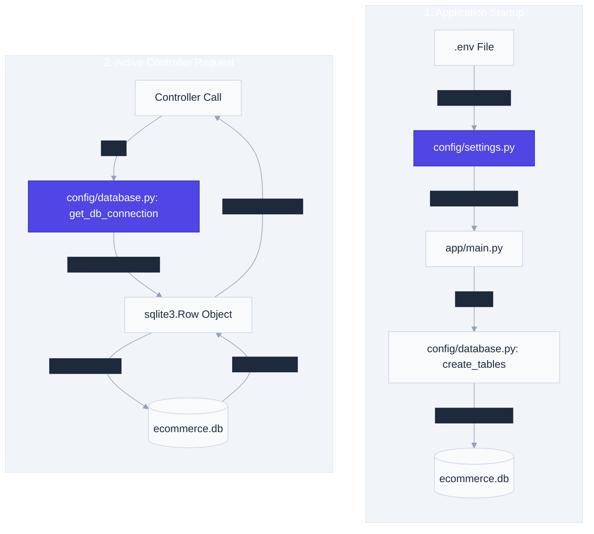

# `app/config/` — Configuration & Database Setup Layer

> Exposes application-wide environment variables, database initialization schemas, SQLite connections, and system settings.

---

## 1. Overview & Purpose

In production backend engineering, configuration parameters and connection initializations must be centralized. The **Config Layer** loads configuration from environment variables and configures database connections.

### Core Architecture Goals:
1. **Separation of Configuration from Code**: Changes to database files, security keys, or token durations should require modifications to the `.env` file only, without changing Python source code.
2. **Environment Parity**: The same code runs in development, testing, staging, and production. Only the environment variables (loaded via `.env`) vary.
3. **Database Handshaking**: Handles connection pooling, connection parameters, row mapping factories, and table schemas.

---

## 2. Configuration & Table Initialization Flow

The configuration layer bootstraps settings on startup and supplies connections during requests:

---

## 3. Files & Specifications

### `settings.py`
Leverages `python-dotenv` to parse environment variables from the `.env` file, supplying them with safe default fallbacks if missing:
* **`APP_NAME`** (Default: `"E-Commerce API"`): Swagger and ReDoc application title.
* **`APP_VERSION`** (Default: `"1.0.0"`): API build version.
* **`DATABASE_PATH`** (Default: `"data/ecommerce.db"`): SQLite database location.
* **`SECRET_KEY`**: Cryptographic key used by `python-jose` to sign JWT access tokens. Must remain highly secure.
* **`ALGORITHM`**: Cryptographic algorithm (default: `"HS256"`) used for JWT signatures.
* **`ACCESS_TOKEN_EXPIRE_MINUTES`** (Default: `30`): Lifetime duration of access tokens.
* **`ADMIN_REGISTRATION_KEY`**: Required key that must match the payload when registering new administrator accounts.

---

### `database.py`
Manages database client connections and schema creations:
* **`get_db_connection() -> sqlite3.Connection`**:
  - Opens a connection to the SQLite database.
  - Configures `conn.row_factory = sqlite3.Row` (allowing columns to be accessed by name like `row["price"]` rather than array index `row[4]`).
  - Sets `check_same_thread=False` to handle FastAPI's concurrent requests.
* **`create_tables()`**:
  - Initializes database schema configurations.
  - Generates the `products`, `orders`, `order_items`, and `users` tables if they do not exist.

---

## 4. Key Design Patterns: SQLite Multi-Threading & Concurrency

By default, the Python `sqlite3` driver restricts connection usage to the specific thread that created it. 

### Why do we configure `check_same_thread=False`?
FastAPI is an asynchronous ASGI framework. It handles incoming requests concurrently using a pool of worker threads. If a request is received, thread A might open a connection. However, during execution context switching, thread B might attempt to read or close that connection.
* If `check_same_thread` is `True` (default), SQLite immediately raises a `ProgrammingError` warning.
* Setting it to `False` enables threads to share connection objects.

> [!CAUTION]
> While `check_same_thread=False` allows multi-threaded connection handling, it places database write concurrency safety on the application code. SQLite does not support highly concurrent writes. Multiple write operations can cause database locking, which is why we must keep our transaction blocks short, run `conn.commit()` immediately, and close connections inside `finally` blocks.

---

## 5. Real-World Analogy

Think of the config layer as the **Infrastructure Control Room in a factory**:
- `settings.py` is the control panel. It specifies target temperatures, voltage inputs, and security keys. If you want to change the voltage, you modify the control panel dashboard settings (`.env`), not the factory machinery.
- `database.py` is the main plumbing pipeline. It connects the machinery to the underground storage tank (database file). It ensures water flows with the correct pressure (row factories) and establishes safety switches (threading options) so pipelines don't burst when multiple machines draw water concurrently.

---

## 6. Interview Questions & Design Takeaways

### 1. Why use `.env` files instead of hardcoding parameters?
Hardcoding sensitive variables (such as `SECRET_KEY` or API keys) in source files exposes credentials to anyone who has access to the Git repository. If the repository is ever pushed to a public host (like GitHub), credentials are leaked. Using `.env` keeps secrets separate from code. Furthermore, using `.env` files lets developers swap from a local development database (`data/ecommerce.db`) to a staging database by simply editing their local config file.

### 2. What are the limitations of `CREATE TABLE IF NOT EXISTS`?
`CREATE TABLE IF NOT EXISTS` only creates a table if no table with that name exists. If the table already exists, SQLite **silently ignores** the statement. If you add a new column to your schema definition (e.g. adding `role` to `users`), SQLite will not update the existing table on startup, resulting in `OperationalError: table has no column named role` when queries run.
* **Development fix**: Delete the SQLite database file (`data/ecommerce.db`) and restart the server, which recreates the tables with the updated schema.
* **Production fix**: Use migration tools (like Alembic) to apply database changes incrementally.

### 3. What is `sqlite3.Row` and why is it preferred over tuple results?
By default, SQLite queries return tuples (e.g. `("Keyboard", 45.0, 10)`). To access the price, you must write `row[1]`. If you ever add a column in the middle of your table schema, all your index numbers shift, breaking code. `sqlite3.Row` maps database rows into dict-like interfaces, enabling access by column name (`row["price"]`), which makes code readable and resilient to schema changes.

---

## 7. 30-Second Revision

- **Config Layer** centralizes environment variables and database clients.
- **`.env` files** isolate secrets (like keys) from source code, preventing security leaks.
- **`check_same_thread=False`** allows FastAPI's multi-threaded handlers to share connection objects.
- **`sqlite3.Row`** enables dictionary-style column access (`row["column_name"]`), preventing index shift bugs.
- **Table Initialization** runs on startup in `main.py` to bootstrap tables if missing.
