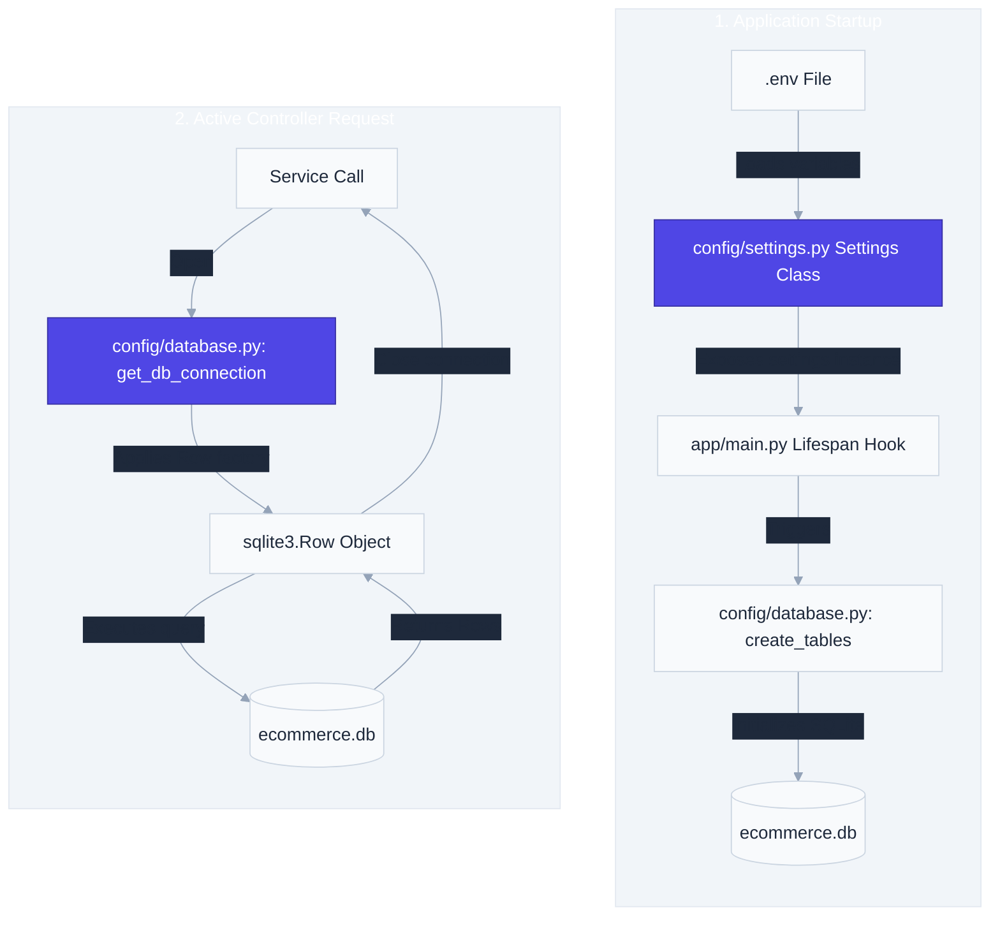

# `app/config/` — Configuration & Database Setup Layer

> Exposes application-wide environment variables, database initialization schemas, SQLite connections, and system settings.

---

## 1. Overview & Purpose

In production backend engineering, configuration parameters and connection initializations must be centralized. The **Config Layer** loads configuration from environment variables and configures database connections.

### Core Architecture Goals:
1. **Separation of Configuration from Code**: Changes to database files, security keys, or token durations should require modifications to the `.env` file only, without changing Python source code.
2. **Environment Parity**: The same code runs in development, testing, staging, and production. Only the environment variables (loaded via `.env`) vary.
3. **Database Handshaking**: Handles connection pooling, connection parameters, row mapping factories, and table schemas.

---

## 2. Configuration & Table Initialization Flow

The configuration layer bootstraps settings on startup and supplies connections during requests:

---

## 3. Files & Specifications

### `settings.py`
Leverages `pydantic-settings` to declare and validate type-safe settings:
* **`env`** (Default: `"development"`): Application environment profile.
* **`allowed_origins`** (Default: `"*"`): Allowed origins list for CORS middleware.
* **`app_name`** (Default: `"E-Commerce API"`): Swagger and ReDoc application title.
* **`app_version`** (Default: `"1.0.0"`): API build version.
* **`database_path`** (Default: `"data/ecommerce.db"`): SQLite database location.
* **`secret_key`**: Cryptographic key used by `PyJWT` to sign JWT access tokens. Must remain highly secure.
* **`algorithm`** (Default: `"HS256"`): Cryptographic algorithm used for JWT signatures.
* **`access_token_expire_minutes`** (Default: `30`): Lifetime duration of access tokens.
* **`admin_registration_key`**: Required key that must match the payload when registering new administrator accounts.
* **`port`** (Default: `8000`): Port number for binding the uvicorn network server.

---

### `database.py`
Manages database client connections and schema creations:
* **`get_db_connection() -> sqlite3.Connection`**:
  - Opens a connection to the SQLite database file at `database_path`.
  - Sets `conn.row_factory = sqlite3.Row` — columns are accessed by name (`row["price"]`) rather than integer index.
  - Sets `check_same_thread=False` to allow FastAPI's concurrent worker threads to share connections safely.
  - Enables `PRAGMA foreign_keys = ON` to enforce referential integrity between tables.
  - Logs connection initialization metrics using the unified `logger` utility.
* **`create_tables()`**:
  - Called at application startup via the ASGI `lifespan` context manager in `main.py`.
  - Creates all four tables using `CREATE TABLE IF NOT EXISTS` so restarts never reset data.

---

## 4. Key Design Patterns: SQLite Concurrency

FastAPI is an asynchronous ASGI framework. It handles incoming requests concurrently using a pool of worker threads. If a request is received, thread A might open a connection. However, thread B might attempt to read or close that connection.
* Setting `check_same_thread=False` enables threads to share connection objects.
* Because SQLite does not support concurrent write transactions, multiple write operations can cause database locking. We prevent locks by keeping our transaction blocks short, running `conn.commit()` immediately, and wrapping connections in `try/finally` blocks inside services.

---

## 5. Real-World Analogy

Think of the config layer as the **Infrastructure Control Room in a factory**:
- `settings.py` is the control panel. It specifies target temperatures, voltage inputs, and security keys. If you want to change the settings, you modify the control panel dashboard settings (`.env`), not the factory machinery.
- `database.py` is the main plumbing pipeline. It connects the machinery to the underground storage tank (database file). It ensures water flows with the correct pressure (row factories) and establishes safety switches so pipelines don't burst when multiple machines draw water concurrently.

---

## 6. 30-Second Revision

- **Config Layer** centralizes environment variables and database clients.
- **`pydantic-settings`** provides type-safe schema validation for all parameters.
- **`check_same_thread=False`** allows FastAPI's multi-threaded handlers to share connection objects.
- **`sqlite3.Row`** enables dictionary-style column access (`row["column_name"]`), preventing index shift bugs.
- **Lifespan Hook** runs on startup in `main.py` to bootstrap tables if missing.
