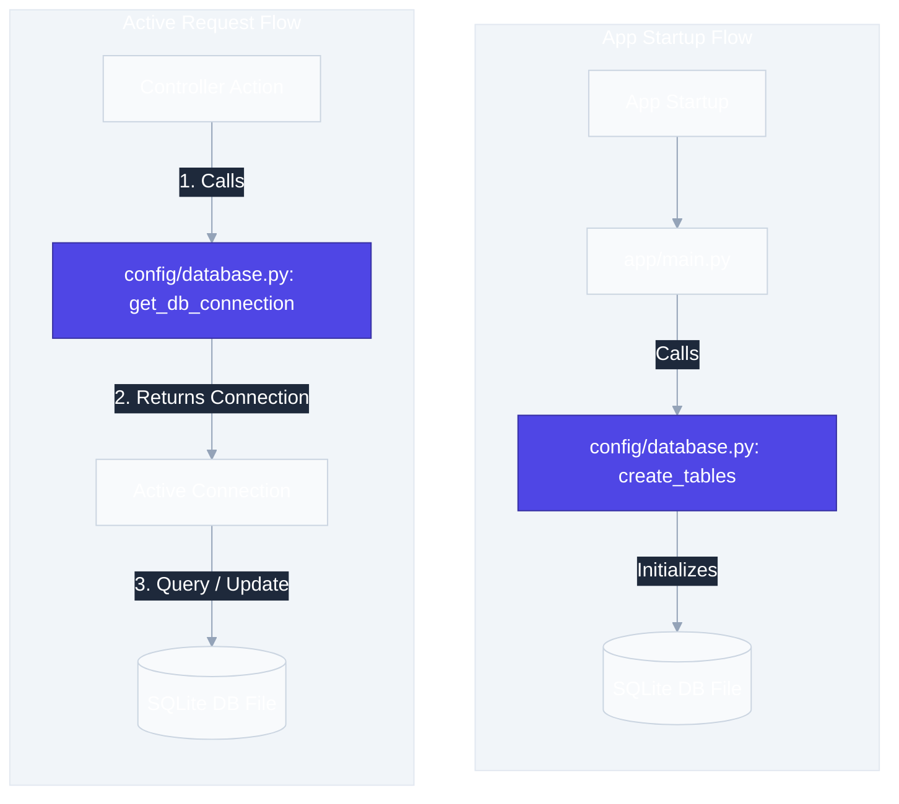

# `app/config/` — Configuration & Database Setup

> Centralizes application settings and database infrastructure. Change database paths, API keys, or table schemas here — nowhere else.

## Files

### `settings.py`

Loads environment variables from the `.env` file using `python-dotenv` and exposes them as module-level constants.

| Variable | Default | Purpose |
|---|---|---|
| `APP_NAME` | `"E-Commerce API"` | Application title shown in Swagger docs |
| `APP_VERSION` | `"1.0.0"` | API version string |
| `DATABASE_PATH` | `"data/ecommerce.db"` | Path to the SQLite database file |
| `ADMIN_API_KEY` | `"admin123"` | API key for admin operations |

> [!CAUTION]
> Never hardcode secrets in Python files. Always use `.env` for API keys and credentials. The `.env` file is excluded from Git via `.gitignore`.

### `database.py`

Manages SQLite connections and table creation.

| Function | Purpose | Called By |
|---|---|---|
| `get_db_connection()` | Returns an active SQLite connection with `Row` factory | Controllers |
| `create_tables()` | Creates `products`, `orders`, `order_items` tables if they don't exist | `main.py` on startup |

### `dependencies.py`

Contains reusable FastAPI dependencies, specifically for request security and validation.

| Function / Dependency | Purpose | Header Required |
|---|---|---|
| `verify_admin_api_key()` | Validates client API key against the configured admin key | `X-API-Key` |

> [!IMPORTANT]
> **FastAPI Dependency Injection (`Depends`)**:
> Using `Depends` decouples our authentication logic from our route functions. The route handler declares the dependency, and FastAPI resolves it before invoking the function. If validation fails (e.g., invalid/missing API key), FastAPI immediately returns a `401 Unauthorized` response without running the route's body.

> [!WARNING]
> `CREATE TABLE IF NOT EXISTS` will **not** update existing tables. If you add a column to the schema, you must delete `data/ecommerce.db` and restart the server (or use migrations).

## Request Flow

## Real-World Analogy

- `settings.py` = The control panel / thermostat settings
- `database.py` = The plumbing system connecting the building to the water supply

## Best Practices

**Do:** Use default values in `os.getenv()` so the app runs even without a `.env` file.
**Don't:** Commit `.env` to Git. Don't run business queries inside `settings.py`.

## 30-Second Revision

- `settings.py` loads variables from `.env` using `python-dotenv`
- `database.py` provides `get_db_connection()` and `create_tables()`
- `dependencies.py` implements reusable route dependencies like administrative API key validation via FastAPI `Depends()`
- `sqlite3.Row` lets you access columns by name (`row["price"]`) instead of index
- Changing table schemas requires deleting the `.db` file or running migrations
