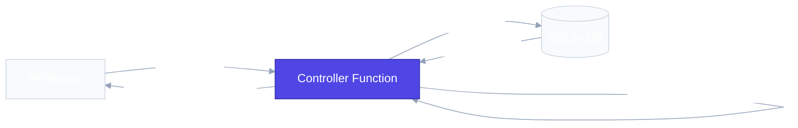

# `app/controllers/` — Business Logic Layer

> Where the real work happens. Controllers execute database operations, apply business rules, and return structured responses.

## Why Separate Controllers From Routes?

Routes define *what* endpoints exist. Controllers define *what happens* when those endpoints are called. This separation lets you:

- **Reuse logic** — Call `create_product()` from a route, a CLI tool, or a test
- **Test without HTTP** — Unit test business logic directly, no server needed
- **Keep files focused** — Routes stay small, controllers stay testable

## Files

### `product_controller.py`

| Function | Purpose |
|---|---|
| `create_product(product)` | INSERT into database, return `ProductResponse` |
| `get_all_products()` | SELECT all products, return list of `ProductResponse` |
| `get_product_by_id(product_id)` | SELECT by ID, raise `ProductNotFoundException` if missing |
| `delete_product(product_id)` | DELETE by ID, raise `ProductNotFoundException` if missing |

### `order_controller.py`

Coordinates database operations and business logic to manage customer orders.

| Function | Purpose |
|---|---|
| `create_order(order: OrderCreate)` | Validates stock, calculates totals, inserts order details, updates product inventory, and commits transactions. |
| `get_all_orders()` | Retrieves all customer orders along with their nested items from the database. |
| `get_order_by_id(order_id: int)` | Retrieves a single customer order with items by ID; raises `OrderNotFoundException` if it doesn't exist. |

---

## Deep Dive: Order Controller (`order_controller.py`)

### Purpose

The `order_controller.py` file contains the **business logic** for handling customer orders.

Unlike the Product Controller, which mainly performs CRUD operations on a single table, the Order Controller coordinates multiple database operations to create a complete order.

### Responsibilities

The Order Controller is responsible for:
* Creating customer orders.
* Validating requested products.
* Checking product stock availability.
* Calculating the total order amount.
* Creating records in the `orders` table.
* Creating records in the `order_items` table.
* Updating product inventory after a successful order.
* Returning the final order response.

### Why is it different from Product Controller?

The Product Controller works with only one table (`products`).

The Order Controller works with multiple related tables:
* `products`
* `orders`
* `order_items`

Because of this, it contains **business logic**, not just database CRUD operations.

### Order Processing Workflow

When a client places an order, the controller follows this sequence:

1. Receive the order request.
2. Validate the request using Pydantic schemas.
3. Loop through every product in the order.
4. Verify that each product exists.
5. Check whether enough stock is available.
6. Calculate the total order price.
7. Create a new record in the `orders` table.
8. Insert each purchased product into the `order_items` table.
9. Reduce stock quantities in the `products` table.
10. Commit the transaction.
11. Return the created order.

### Why do we loop through `order.items`?

A customer can purchase multiple products in a single order.

Example request body:
```json
{
    "items": [
        {
            "product_id": 1,
            "quantity": 2
        },
        {
            "product_id": 3,
            "quantity": 1
        }
    ]
}
```

Since the order contains a list of products, the controller must process each product individually. For every product, it:
* Checks if the product exists.
* Checks stock availability.
* Reads the product price.
* Uses the information to calculate the order total.

### One Order vs Multiple Order Items

A customer creates **one order**, but that order can contain **many products**.

**Order**
| Order ID | Total |
| -------- | ----- |
| 1        | ₹850  |

**Order Items**
| Order ID | Product ID | Quantity |
| -------- | ---------- | -------- |
| 1        | 1          | 2        |
| 1        | 3          | 1        |
| 1        | 5          | 4        |

This relationship is why the project uses separate `orders` and `order_items` tables.

### Business Logic

The Order Controller is the first place in this project where multiple business rules are executed together.

Examples include:
* Product must exist.
* Product must have sufficient stock.
* Order total must be calculated correctly.
* Inventory must be updated after purchase.

These rules ensure data consistency and prevent invalid orders.

### Database Tables Used

The controller interacts with three tables:
* `products`
* `orders`
* `order_items`

### Key Learning

The Product Controller focuses on **CRUD operations**, while the Order Controller introduces **business logic** by coordinating multiple tables, validating data, calculating totals, and maintaining inventory consistency.

---

## How Exception Handling Works

Controllers raise domain exceptions — they never return HTTP status codes directly:

```python
if row is None:
    raise ProductNotFoundException(product_id)
    # Controller says: "I couldn't find this product."
    # It doesn't know about 404, JSON, or HTTP.
```

The global exception handler in `app/exceptions/handlers.py` catches this and translates it into a `404` JSON response.

## Request Flow



> [!NOTE]
> The **Controller Layer** is where the application's actual logic runs (indicated in blue). It queries the database, executes validation rules, and returns the result back to the routing layer.

## Real-World Analogy

Controllers = **The chef in a restaurant**. The waiter (route) takes the order and brings it to the kitchen. The chef (controller) reads the order, checks the pantry (database), cooks the meal (business logic), and plates it (response schema).

## Best Practices

**Do:** Close `conn.close()` before raising exceptions to prevent connection leaks.

**Don't:** Import `APIRouter` or return `JSONResponse` from controllers. They should know nothing about HTTP.

## 30-Second Revision

- Controllers contain all business logic and database operations
- They are called by route handlers
- They raise custom exceptions for error cases (never HTTP status codes)
- They return Pydantic schema objects (never raw dictionaries for success responses)
- Always close database connections — especially before raising exceptions
