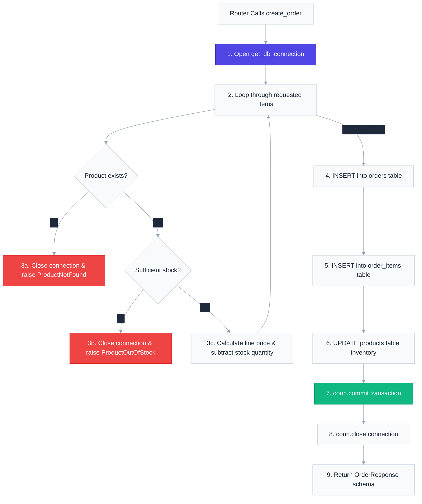

# `app/controllers/` — Business Logic & Database Layer

> Where the core application rules live. Controllers execute database operations, apply business validations, manage transactions, and output structured models.

---

## 1. Overview & Purpose

In backend engineering, the **Controller Layer** contains the core brain of the application. While routes define the HTTP contract, controllers enforce business rules and manipulate data. 

### Core Design Principles:
1. **HTTP Agnostic**: Controllers have no knowledge of FastAPI routers, status codes, or HTTP headers. They receive raw Python parameters or Pydantic schemas, and return Python objects or schemas. This lets you reuse controller functions in CLI commands, cron tasks, or tests without simulating HTTP requests.
2. **Resource Management**: Controllers are responsible for acquiring database connections (`get_db_connection()`), performing queries, and closing connection handles to prevent SQLite pool starvation.
3. **Exception Delegation**: If a business validation fails (e.g. out of stock), the controller immediately stops execution and raises a custom domain exception, letting the handler layer handle the HTTP response.

---

## 2. Business Flow & Database Interaction

Controllers coordinate multiple schemas and table modifications. Below is the controller execution cycle during order creation:



---

## 3. Files & Specifications

### `product_controller.py`
Enforces basic CRUD rules for the product catalog:
* **`create_product(product: ProductCreate) -> ProductResponse`**
  - Inserts product records (including `cost_price` stored in DB but hidden from response).
* **`get_all_products() -> List[ProductResponse]`**
  - SELECTs all rows from `products`, maps each to `ProductResponse`.
* **`get_product_by_id(product_id: int) -> ProductResponse`**
  - Fetches a single product. Raises `ProductNotFoundException` if the ID does not exist.
* **`update_product(product_id: int, product: ProductUpdate) -> ProductResponse`**
  - First checks if the product exists; raises `ProductNotFoundException` if not. Then applies partial updates — any field set to `None` in the `ProductUpdate` schema keeps its existing DB value. Commits the UPDATE and returns the merged `ProductResponse`.
* **`delete_product(product_id: int) -> dict`**
  - DELETEs the product row. Uses `cursor.rowcount == 0` to detect missing IDs, raises `ProductNotFoundException` before closing the connection.

---

### `order_controller.py`
Orchestrates complex transaction logic spanning multiple tables:
* **`create_order(order: OrderCreate) -> OrderResponse`**
  - **Stock Check**: Before saving, loops through all items to verify product existence and inventory levels.
  - **Atomic Transaction**: Inserts a header row into `orders`, multiple rows into `order_items`, and updates product stock quantities in a single committed transaction.
* **`get_all_orders() -> List[OrderResponse]`**
  - Performs joint queries to retrieve placed orders and their nested item lists.
* **`get_order_by_id(order_id: int) -> OrderResponse`**
  - Retrieves detailed order histories, raising `OrderNotFoundException` if the ID is missing.

---

### `user_controller.py`
Manages account registration and profile management:
* **`create_user(user: UserCreate) -> UserResponse`**
  - Bcrypt-hashes the password, INSERTs to `users` with `role = 'customer'` (default). Returns `UserResponse` with `lastrowid`.
* **`create_admin(admin: AdminRegisterRequest) -> UserResponse`**
  - Validates `admin.admin_key` against `ADMIN_REGISTRATION_KEY` from settings. Raises `PermissionDeniedException` (403) if the key is wrong. If authorized, inserts with `role = 'admin'`.
* **`update_current_user(current_user: UserResponse, user: UserUpdate) -> UserResponse`**
  - UPDATEs `username` and `email` for the authenticated user's row. Sets `updated_at = CURRENT_TIMESTAMP`. Returns merged `UserResponse` from the injected user context + new values.
* **`change_password(current_user: UserResponse, password_data: ChangePasswordRequest) -> dict`**
  - Fetches the user's current `hashed_password` from DB. Bcrypt-verifies `old_password` — raises `InvalidPasswordException` (400) if wrong. If correct, hashes `new_password` and UPDATEs the row.

---

### `auth_controller.py`
Manages credentials verification:
* **`login_user(form_data: OAuth2PasswordRequestForm) -> TokenResponse`**
  - Fetches user records by email (`form_data.username`).
  - Asserts if the account is active.
  - Passes credentials to Bcrypt verification. If successful, issues a JWT access token carrying the user's email and role.

---

## 4. Key Design Patterns: Database Resource Safety

A common issue in SQLite development is the **Database Locked** error. Because SQLite is serverless and reads/writes directly to a single file, it has strict constraints on concurrent operations.

To prevent connections from locking up:
1. **Always Close in Error Blocks**: If you raise an exception inside a loop, Python immediately interrupts execution. If you do not close the database connection *before* raising the exception, that connection remains open in memory, leaking resources.
2. **Explicit Commit**: SQLite transactions only save changes permanently when `conn.commit()` is called. If your script crashes halfway, the database automatically rolls back, preserving integrity.

```python
# Proper pattern:
conn = get_db_connection()
cursor = conn.cursor()
try:
    cursor.execute("SELECT stock_quantity FROM products WHERE id = ?", (product_id,))
    row = cursor.fetchone()
    if row is None:
        conn.close() # <-- Release connection before raising error!
        raise ProductNotFoundException(product_id)
        
    # Process modifications...
    conn.commit()
finally:
    conn.close() # <-- Safe backup release
```

---

## 5. Real-World Analogy

Think of controllers as **The Head Chef in a kitchen**:
- The waiters (routes) receive orders and forms from the customers. They check if the form is valid and bring it to the kitchen counter.
- The Chef (controller) reads the recipe. They check the pantry database (`database.py`) to see if they have enough ingredients (stock checks).
- If they are missing ingredients, the Chef shouts out an error (`ProductOutOfStockException`) and stops cooking.
- If they have everything, the Chef prepares the entire meal (atomic transaction steps), plates it up according to the menu card (output schema validation), and hands it back to the waiter.

---

## 6. Interview Questions & Design Takeaways

### 1. Why decouple controllers from routes?
Decoupling routes from controllers keeps the code **testable** and **modular**. You can write unit tests directly against `create_order` by passing mock data schemas, avoiding the overhead of setting up test servers or HTTP client connections. Furthermore, if you migrate from HTTP to WebSockets or a messaging queue (e.g. RabbitMQ), you can reuse your controller functions without rewriting code.

### 2. How do you handle database race conditions in stock updates?
In highly concurrent environments (e.g., flash sales), two users might check stock simultaneously, see `1` item remaining, and attempt to buy. This causes **overselling**. 
* In this raw SQLite setup, we check and update in separate steps (which is susceptible to race conditions).
* In production systems (Phase 4+), we resolve this using database-level locking (e.g., `SELECT ... FOR UPDATE` in PostgreSQL) or check constraints directly in SQL updates (e.g., `UPDATE products SET stock = stock - 1 WHERE id = 1 AND stock >= 1`).

### 3. What is Bcrypt password hashing, and why is it preferred?
Bcrypt is a blowfish-based hashing algorithm that incorporates a **salt** (to prevent rainbow table attacks) and a **work factor** (which slows down execution speed). This deliberate speed constraint makes brute-force attacks computationally expensive, securing user data against server compromises.

---

## 7. 30-Second Revision

- **Controller Layer** encapsulates all business rules and SQLite queries.
- **Decoupled from HTTP**: Receives Python types/schemas, throws exceptions, returns schemas.
- **Resource Management**: Must close connections inside both success and error blocks to prevent SQLite file locks.
- **Password Safety**: Uses Bcrypt hashing to encrypt credentials before writing to the users table.
- **Atomic Operations**: Commits changes at the very end of processing, ensuring a transaction succeeds fully or fails completely (no partial data corruption).
