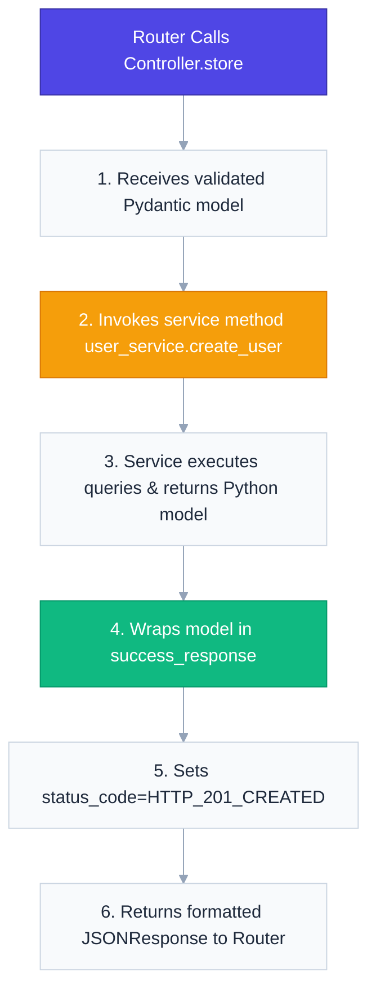

# `app/controllers/` — Controller Orchestration Layer

> Class-based controllers utilizing static methods to orchestrate requests, invoke business services, map HTTP responses, and wrap outputs in standardized success envelopes.

---

## 1. Overview & Purpose

In clean web architecture, the **Controller Layer** coordinates the interaction between incoming request data and backend business operations. Under our updated production-grade architecture, the controllers have a single responsibility: **orchestrating request logic and building standardized HTTP response payloads**.

### Core Design Principles:
1. **Class-Based Encapsulation**: Controllers are structured as classes with `@staticmethod` signatures following REST naming conventions (`index`, `store`, `show`, `update`, `destroy`).
2. **Zero Database Logic**: Controllers do not contain any database queries, raw SQL commands, or transaction management. Database queries are delegated entirely to the **Service Layer** (`app/services/`).
3. **Response Enveloping**: Controllers wrap successful database entities in a unified JSON schema (via the `success_response` utility) and map proper HTTP status codes.

---

## 2. Request-Response Lifecycle

Controllers bridge the gap between HTTP routing inputs and the core python business operations layer:

---

## 3. Files & Specifications

### `product_controller.py`
Enforces basic CRUD mapping for the product catalog:
* **`store(product: ProductCreate) -> JSONResponse`**
  - Invokes `product_service.create_product(product)`.
  - Returns `success_response` with `HTTP_201_CREATED`.
* **`index() -> JSONResponse`**
  - Invokes `product_service.get_all_products()`.
* **`show(product_id: int) -> JSONResponse`**
  - Invokes `product_service.get_product_by_id(product_id)`.
* **`update(product_id: int, product: ProductUpdate) -> JSONResponse`**
  - Invokes `product_service.update_product(product_id, product)`.
* **`destroy(product_id: int) -> JSONResponse`**
  - Invokes `product_service.delete_product(product_id)`.

---

### `order_controller.py`
Maps order operations to services:
* **`store(order: OrderCreate, current_user: UserResponse) -> JSONResponse`**
  - Invokes `order_service.create_order(order, current_user)`.
  - Returns `success_response` with `HTTP_201_CREATED`.
* **`index() -> JSONResponse`**
  - Invokes `order_service.get_all_orders()`.
* **`show(order_id: int) -> JSONResponse`**
  - Invokes `order_service.get_order_by_id(order_id)`.

---

### `user_controller.py`
Maps account registration and profile management:
* **`store(user: UserCreate) -> JSONResponse`**
  - Invokes `user_service.create_user(user)`.
  - Returns `success_response` with `HTTP_201_CREATED`.
* **`store_admin(admin: AdminRegisterRequest) -> JSONResponse`**
  - Invokes `user_service.create_admin(admin)`.
  - Returns `success_response` with `HTTP_201_CREATED`.
* **`show(current_user: UserResponse) -> JSONResponse`**
  - Returns current user details wrapped in `success_response`.
* **`update(current_user: UserResponse, user: UserUpdate) -> JSONResponse`**
  - Invokes `user_service.update_current_user(current_user, user)`.
* **`change_password(current_user: UserResponse, password_data: ChangePasswordRequest) -> JSONResponse`**
  - Invokes `user_service.change_password(current_user, password_data)`.

---

### `auth_controller.py`
Handles login authorization mapping:
* **`login(form_data: OAuth2PasswordRequestForm) -> dict`**
  - Invokes `auth_service.login_user(form_data)`.
  - Returns the raw token payload (`access_token`, `token_type`) directly at the root level to conform with OAuth2 specification and allow native Swagger UI authentication.

---

## 4. Key Design Patterns: REST Convention Naming

Our controllers use standard REST mapping names for clean code readability:
- **`index`**: Retrieve a list of records.
- **`store`**: Create a new record.
- **`show`**: Get details of a single record by ID.
- **`update`**: Modify an existing record.
- **`destroy`**: Delete a record.

---

## 5. 30-Second Revision

- **Controller Layer** coordinates HTTP payload formatting and service invocation.
- **Class-Based Structure** encapsulates functions as clean static methods.
- **Zero SQL/DB Logic**: All transactions are delegated to the **Service Layer** to maintain database isolation.
- **Success Envelopes**: Integrates `success_response()` and status constants (like `HTTP_201_CREATED`) to format outputs consistently.
