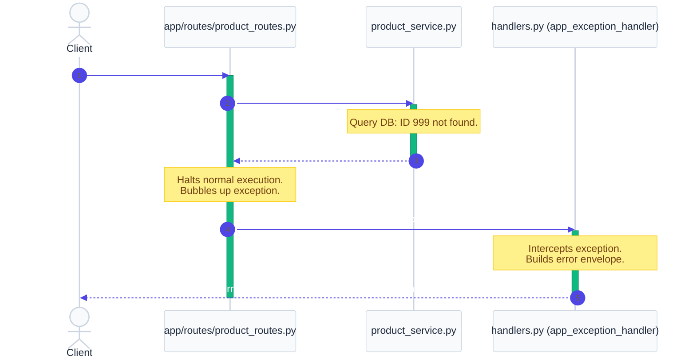

# `app/exceptions/` — Global Exception Handling Layer

> Decouples business logic from the HTTP protocol. Maps custom domain exceptions raised in controllers and services to structured JSON responses with correct HTTP status codes.

---

## 1. Overview & Purpose

In standard backend development, business logic should never know about HTTP details. A database operation shouldn't care about JSON formats, header codes, or status strings. If a record is missing or stock is empty, it should simply raise a Python exception and halt.

The **Exceptions Layer** sits on the perimeter of the application, intercepting these exceptions and translating them into a clean, standardized API error format.

### Key Benefits:
1. **Traceback Masking**: Raw database or Python execution tracebacks never leak to the client, preventing exposure of internal directory structures or SQL queries.
2. **Decoupled Architecture**: Controllers and services remain pure and testable. They don't import `HTTPException` or `JSONResponse` from FastAPI.
3. **Standardized Responses**: Every error returns a consistent JSON payload:
   ```json
   { "status": "fail", "message": "...", "errors": [...] }
   ```

---

## 2. Exception Lifecycle & Request Cycle

When an execution throws an exception, normal processing halts, and the request is intercepted by FastAPI's exception middleware handlers:



---

## 3. Files & Exception Catalog

### `custom_exceptions.py`
Defines domain-specific Python exception classes:
- **`AppException`**: Base exception class for all custom errors.
- **`BadRequestException`**: General 400 Bad Request error.
- **`UnauthorizedException`**: General 401 Unauthorized error.
- **`ForbiddenException`**: General 403 Forbidden error.
- **`NotFoundException`**: General 404 Not Found error.
- **`ConflictException`**: General 409 Conflict error.

**Domain Specific subclasses:**
- **`ProductNotFoundException`**: Raised when a requested product ID is missing from SQLite (404).
- **`OrderNotFoundException`**: Raised when an order ID is missing from SQLite (404).
- **`ProductOutOfStockException`**: Raised when an order's requested quantity exceeds inventory (409).
- **`InvalidCredentialsException`**: Raised when credentials fail verification (401).
- **`InvalidTokenException`**: Raised when JWT validation fails (401).
- **`PermissionDeniedException`**: Raised when a user lacks permission (403).
- **`InvalidPasswordException`**: Raised when current password verification fails (400).

---

### `handlers.py`
Maps exceptions to HTTP responses:
- **`app_exception_handler`**: Catches `AppException` and returns its custom status code and message.
- **`validation_exception_handler`**: Catches Pydantic / parameter parsing errors (`RequestValidationError`), formatting them into a standard errors list with fields.
- **`http_exception_handler`**: Catches Starlette HTTP exceptions (like 404 Page Not Found or 405 Method Not Allowed).
- **`global_exception_handler`**: Catches any otherwise unhandled server exceptions (500), logs the stack trace to the terminal, and hides details from the user.

---

## 4. 30-Second Revision

- **Exceptions Layer** converts custom domain errors into clean HTTP responses.
- **Traceback Protection**: Prevents raw SQL or Python errors from leaking to API consumers.
- **Status Codes Map**:
  - Lack of credentials/invalid token &rarr; `401 Unauthorized`
  - Insufficient role rights / wrong admin key &rarr; `403 Forbidden`
  - Missing catalog/order entries &rarr; `404 Not Found`
  - Stock/inventory conflicts &rarr; `409 Conflict`
  - Incorrect old password during change &rarr; `400 Bad Request`
- **Controller Separation**: Controllers only raise raw Python exceptions; they never import FastAPI `HTTPException`.
