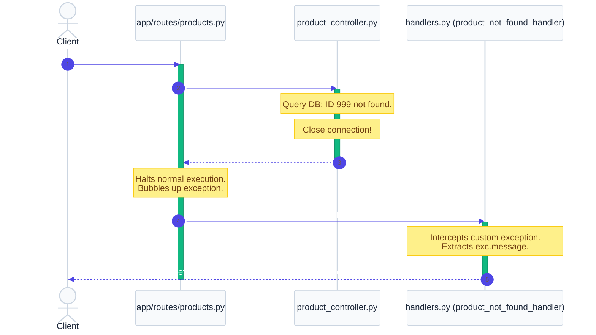

# `app/exceptions/` — Global Exception Handling Layer

> Decouples business logic from the HTTP protocol. Maps custom domain exceptions raised in controllers to structured JSON responses with correct HTTP status codes.

---

## 1. Overview & Purpose

In standard backend development, business logic (controllers) should never know about HTTP details. A controller querying the database shouldn't care about JSON formats, header codes, or status strings. If a record is missing, the controller should simply raise a Python exception and halt.

The **Exceptions Layer** sits on the perimeter of the application, intercepting these exceptions and translating them into a clean, standardized API error format.

### Key Benefits:
1. **Traceback Masking**: Raw database or Python execution tracebacks never leak to the client, preventing exposure of internal directory structures or SQL queries.
2. **Decoupled Architecture**: Controllers remain pure and testable. They don't import `HTTPException` or `JSONResponse` from FastAPI.
3. **Standardized Responses**: Every error returns a consistent JSON payload (e.g. `{"status": "error", "message": "..."}`), making client-side error parsing simple.

---

## 2. Exception Lifecycle & Request Cycle

When a controller throws an exception, normal execution halts, and the request is intercepted by FastAPI's exception middleware handlers:

---

## 3. Files & Exception Catalog

### `custom_exceptions.py`
Defines domain-specific Python exception classes:
* **`ProductNotFoundException`**: Raised when a requested product ID is missing from SQLite.
* **`OrderNotFoundException`**: Raised when an order ID is missing from SQLite.
* **`ProductOutOfStockException`**: Raised when an order's requested quantity exceeds available catalog inventory.
* **`InvalidCredentialsException`**: Raised when user login credentials (email or password) fail verification.
* **`InvalidTokenException`**: Raised when a JWT access token signature, encoding, or expiration verification fails.
* **`PermissionDeniedException`**: Raised when an authenticated user lacks the required role to execute a route. Also raised when an incorrect `admin_key` is provided during admin registration.
* **`InvalidPasswordException`**: Raised when the user provides an incorrect `old_password` during a password change request.

---

### `handlers.py`
Maps custom exceptions to HTTP response JSON formats:
* **`product_not_found_handler`** &rarr; `404 Not Found`
* **`order_not_found_handler`** &rarr; `404 Not Found`
* **`product_out_of_stock_handler`** &rarr; `409 Conflict` (resource state conflict)
* **`invalid_credentials_handler`** &rarr; `401 Unauthorized` (identity verification failed)
* **`invalid_token_handler`** &rarr; `401 Unauthorized` (token invalid or expired)
* **`permission_denied_handler`** &rarr; `403 Forbidden` (identity verified, but permissions lacking)
* **`invalid_password_handler`** &rarr; `400 Bad Request` (old password verification failed during password change)

---

## 4. Real-World Analogy

Think of global exception handlers as a **Hospital Receptionist handling medical emergencies**:
- The doctor (controller) is treating a patient. If the doctor runs into a severe issue (e.g. they run out of blood type A), they don't walk out to the waiting room to talk to the patient's family. They simply trigger an emergency protocol (`ProductOutOfStockException`).
- The hospital's reception coordinator (exception handler) catches the emergency signal, looks at the protocol, and goes out to explain to the family in simple, calm, standardized terms (`409 Conflict` status with a clean message).
- The doctor remains in the operating room (the controller logic is isolated), and the family receives a polite explanation instead of medical jargon and raw clinical panic (no SQL tracebacks leak to clients).

---

## 5. Interview Questions & Tips

### 1. Why not raise `HTTPException` inside controllers?
Raising `HTTPException` directly in controllers couples your core business logic to the HTTP protocol. If you want to run the same code in a offline background worker (e.g., Celery task) or a CLI command, raising an `HTTPException` makes no sense because there is no HTTP request context. Raising custom Python exceptions keeps controllers reusable and clean.

### 2. What is the difference between `401 Unauthorized` and `403 Forbidden`?
* **`401 Unauthorized`** (better described as "Unauthenticated"): The server does not know who you are. Your token is missing, expired, or credentials are wrong. You must log in.
* **`403 Forbidden`**: The server knows exactly who you are (your JWT was validated successfully), but you do not have permission to access that resource. For example, a customer trying to call admin endpoints.

### 3. Why map `ProductOutOfStockException` to `409 Conflict` instead of `400 Bad Request`?
`400 Bad Request` generally implies client syntax errors (e.g., malformed JSON). `409 Conflict` is the correct HTTP status code for requests that are syntactically correct but conflict with the current state of server resources (such as trying to purchase 10 items when only 2 are in stock).

---

## 6. 30-Second Revision

- **Exceptions Layer** converts custom domain errors into clean HTTP responses.
- **Traceback Protection**: Prevents raw SQL or Python errors from leaking to API consumers.
- **Status Codes Map**:
  - Lack of credentials/invalid token &rarr; `401 Unauthorized`
  - Insufficient role rights / wrong admin key &rarr; `403 Forbidden`
  - Missing catalog/order entries &rarr; `404 Not Found`
  - Stock/inventory conflicts &rarr; `409 Conflict`
  - Incorrect old password during change &rarr; `400 Bad Request`
- **Controller Separation**: Controllers only raise raw Python exceptions; they never import FastAPI `HTTPException`.
