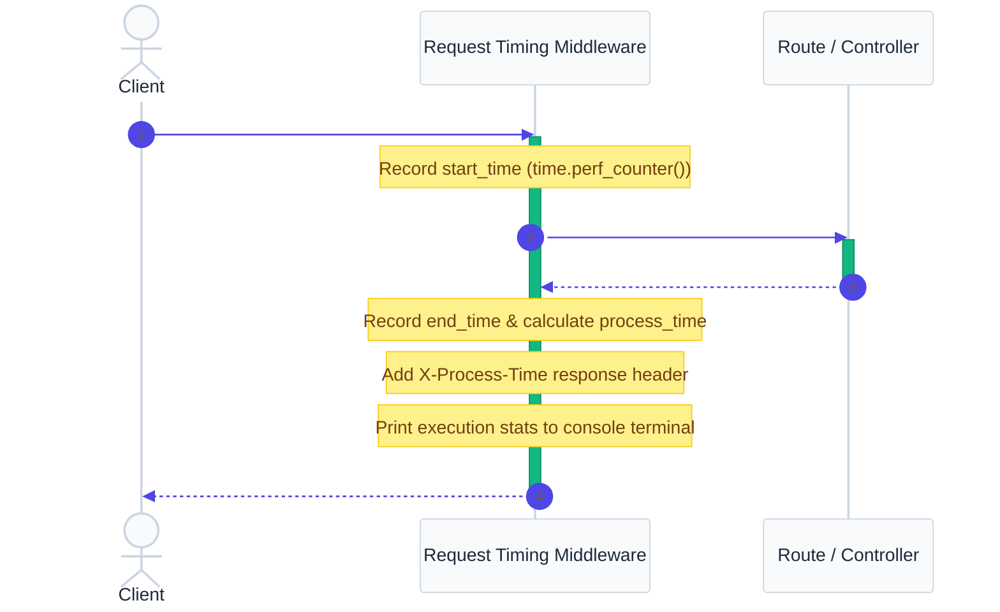

# `app/middleware/` — Request Interception Layer

> Runs automatically on **every** request and response cycle. Used to intercept incoming requests, apply timing headers, and format console log reports.

---

## 1. Overview & Purpose

In web API engineering, **Middleware** handles cross-cutting concerns that apply globally across all endpoints.

Without middleware, if you wanted to measure request timing or log requests, you would need to add timing logic to every single route handler. This violates the **DRY (Don't Repeat Yourself)** principle and clutters the codebase. 

### Core Responsibilities:
1. **Request Interception**: Inspects and records timestamps as soon as the HTTP request hits the server.
2. **Response Modification**: Modifies outgoing headers (e.g. injecting `X-Process-Time` or CORS access headers) before yielding the bytes back to the client.
3. **Execution Safety**: Must handle exceptions gracefully so that requests aren't left hanging in the event of controller crashes.
4. **Minimal Overhead**: Must execute extremely fast. Since middleware wraps every endpoint, adding 10ms of latency here slows down the entire application.

---

## 2. Request Timing Lifecycle

The request timing middleware intercepts the connection, measures execution duration, and attaches timing metadata to the response headers:



---

## 3. Files & Implementations

### `timing.py`
Implements a standard FastAPI HTTP middleware block:
```python
import time
from fastapi import Request

@app.middleware("http")
async def add_process_time_header(request: Request, call_next):
    # 1. Record startup timestamp
    start_time = time.perf_counter()
    
    # 2. Yield control to the route/controller layer
    response = await call_next(request)
    
    # 3. Calculate execution duration
    process_time = time.perf_counter() - start_time
    
    # 4. Inject header and log to console
    response.headers["X-Process-Time"] = str(process_time)
    print(f"{request.method} {request.url.path} - {process_time:.6f} sec")
    
    return response
```

---

## 4. Key Design Patterns: ASGI & Middleware Call Stack

FastAPI middleware uses the **Chain of Responsibility** pattern. The middleware acts as a wrapper around the application.

1. **`call_next` Function**: The second parameter `call_next` is a callback function that represents the next middleware block or the target route handler. By invoking `await call_next(request)`, control is delegated down the stack.
2. **`time.perf_counter()` vs. `time.time()`**:
   * `time.time()` returns system epoch time (which can adjust or shift due to NTP synchronization, leading to inaccurate timings).
   * `time.perf_counter()` returns a high-resolution monotonic clock specifically designed for measuring short durations, which is unaffected by system time adjustments.

---

## 5. Real-World Analogy

Think of middleware as the **Security Checkpoint Gate at a factory entrance**:
- Every delivery truck (request) passes through the gate on the way in.
- The guard records the license plate, stamps a timestamp on the manifest card (`start_time`), and directs the truck to the warehouse loading bay (`call_next`).
- When the truck leaves the loading bay (response), the guard takes the manifest card, records the exit timestamp, calculates the total processing time, staples it as a receipt header (`X-Process-Time`), and lets the truck leave.

---

## 6. Interview Questions & Tips

### 1. Why use middleware for request timing instead of putting timers inside every route?
Using middleware centralizes cross-cutting concerns. It ensures that timing, logging, CORS, or session validation are run automatically for **every request** without requiring developers to duplicate validation code in every route. This keeps route functions small, maintainable, and focused on route delegation.

### 2. Can you access the request body (JSON payload) inside standard middleware?
Yes, but doing so comes with a major catch. Reading `request.body()` inside middleware reads the request stream, which consumes the payload bytes. If you consume the body stream without resetting it, the route handler downstream will find an empty body and fail with a `422 Unprocessable Entity` validation error. Reading request bodies in middleware should generally be avoided unless using specialized request-stream replacers.

### 3. What is the impact of slow middleware code?
Because middleware wraps every single API connection, any latency introduced inside middleware is multiplied across all endpoints. If your middleware does a blocking database read that takes 50ms, **every single request** to your API is slowed down by 50ms. Middleware must be highly optimized, asynchronous, and non-blocking.

---

## 7. 30-Second Revision

- **Middleware** intercepts every request/response cycle globally.
- **`call_next`** yields control down the route execution stack.
- **`time.perf_counter()`** supplies monotonic high-resolution clock timing.
- **`X-Process-Time`** response headers expose processing latency to client consumers.
- **Latency Warning**: Keep middleware lightweight; blocking operations here degrade system-wide throughput.
