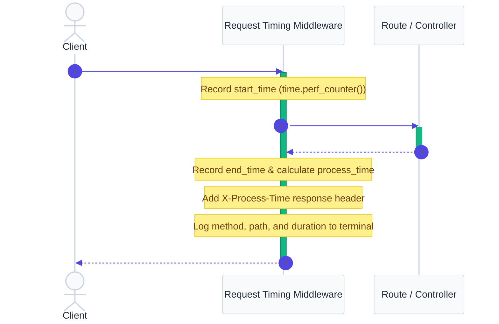

# `app/middleware/` — Request Interception Layer

> Runs on **every** request. Used for timing, logging, authentication, and CORS — things that apply globally.

## Why Middleware?

Without middleware, you'd add timing/logging/auth code to every single route handler. Middleware centralizes cross-cutting concerns so they run automatically on all requests.

## Files

### `timing.py`

Measures and logs execution duration of every API request, and adds the duration to response headers.

**How it works:**

## Real-World Analogy

Middleware = **Security gate at a building entrance**. Every visitor passes through on the way in (request) and on the way out (response). The guard logs entry time, checks credentials, and records exit time.

## Best Practices

**Do:** Keep middleware execution extremely fast — slow middleware slows every request.

**Don't:** Put database queries in middleware. Don't read the request body unless necessary.

## 30-Second Revision

- Middleware runs on every request/response cycle
- Used for timing, logging, CORS, rate limiting, authentication
- Must be fast — adds latency to every single endpoint
- Implemented to add custom `X-Process-Time` response header and terminal logging

## Interview Tip

> [!TIP]
> **Why do we use middleware for request timing instead of putting timers inside every route?**
>
> "Middleware runs for every request automatically. By measuring time in one place, I avoid duplicating timing logic across every route, making the code cleaner, easier to maintain, and ensuring consistent performance monitoring throughout the application."
