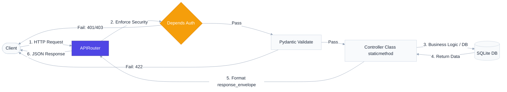

# `app/routes/` — API Endpoint Definitions & Routing Layer

> Maps incoming HTTP requests to their corresponding controller functions, enforces security guards via dependencies, and formats output schemas.

---

## 1. Overview & Purpose

In clean web architecture, the **Routing Layer** acts as the external gateway of the application. Its responsibility is strictly limited to mapping HTTP methods (GET, POST, DELETE, etc.) and URL paths to executable Python code. 

### Why keep routes separate and lightweight?
1. **Zero Business Logic**: Routes should only delegate. If you write SQL or calculations inside a route handler, you mix transport protocols (HTTP) with business rules.
2. **Centralized Version Prefixing**: Routes are registered under `api_v1_router` in `main.py` using a single route aggregator at [index.py](file:///d:/ecommerce-api/app/routes/index.py). All endpoints are prefixed with `/api/v1`.
3. **Guardhouse Security**: Endpoint access rules (authentication and role checks) are declared directly on the route using FastAPI's dependency injection system (`Depends`), keeping controllers clean.
4. **Thin Route Decorators**: Because the controllers return standardized envelopes (via `JSONResponse`), status codes and output formats are configured in the controllers. Route decorators do not specify redundant `status_code` or `response_model` values.

---

## 2. Request Flow & Middleware Gateway

When a request reaches the application, the Routing Layer processes input validation and authorization checks before calling the controller:



---

All route files are grouped by domain and invoke class-based controllers:

*   **Auth Routes (`auth_routes.py`)**: Prefixed with `/auth`.
    * `POST /auth/login` — Sign in to retrieve JWT access token.
*   **User Routes (`user_routes.py`)**: Prefixed with `/users`.
    * `POST /users/register` — Public user self-registration.
    * `POST /users/register-admin` — Administrator registration (requires `admin_key`).
    * `POST /users/register-warehouse` — Warehouse worker registration (Admin Only, `Depends(require_role(ADMIN))`).
    * `GET /users/me` — Retrieve logged-in user profile.
    * `PUT /users/me` — Update user profile details.
    * `PUT /users/change-password` — Update user password.
*   **Product Routes (`product_routes.py`)**: Prefixed with `/products`.
    * `POST /products` — Add a new product to catalog (Admin Only).
    * `GET /products` — List all products (public).
    * `GET /products/{id}` — Get single product by ID (public).
    * `DELETE /products/{id}` — Remove product from database (Admin Only).
*   **Order Routes (`order_routes.py`)**: Prefixed with `/orders`.
    * `POST /orders` — Place order with stock checking (Any authenticated user).
    * `GET /orders` — List orders (paginated; customers see own, admin sees all, warehouse sees Confirmed/Processing only).
    * `GET /orders/{id}` — Retrieve order detail (ownership or admin/warehouse access check).
    * `PATCH /orders/{id}/cancel` — Cancel own Pending order, restoring quantities to stock (Customer Only).
    * `PATCH /orders/{id}/confirm` — Confirm Pending order, saving administrator audit details (Admin Only).
    * `PATCH /orders/{id}/pack` — Begin picking/packaging a Confirmed order, adding warehouse notes (Warehouse Only).
    * `PATCH /orders/{id}/ready` — Complete checklist and mark order ready for shipping (Warehouse Only).
    * `PATCH /orders/{id}/status` — Update order status (Admin Only, validates strict transitions).

---

## 4. Key Patterns: FastAPI Dependency Injection

FastAPI's dependency injection system (`Depends`) executes pre-requisite functions prior to invoking our route handlers. For example:

```python
@router.post("")
def store(
    product: ProductCreate,
    current_user: UserResponse = Depends(require_role(ADMIN))
):
    return ProductController.store(product)
```

1. **Extraction**: FastAPI identifies `Depends(require_role(ADMIN))`.
2. **Chain Resolution**: `require_role` returns a helper dependency that demands `Depends(get_current_user)`.
3. **Execution**: FastAPI extracts the Bearer token from the `Authorization` header, decodes and validates the JWT, checks if the user exists and is active in the database.
4. **Authorization check**: The role checker asserts `current_user.role in (ADMIN,)`. If false, it raises a `PermissionDeniedException` (which bubbles up to trigger a `403 Forbidden` response).
5. **Route execution**: Only if all checks pass does FastAPI invoke the controller static method `ProductController.store(product)`.

---

## 5. Real-World Analogy

Think of routes as the **Hospital Wards Reception Desks**:
- **Public Wards (GET /products)**: Anyone can walk in and read the information boards. No security check required.
- **Patient Registration desk (POST /users/register)**: Open to the public, but you must fill out the correct intake form (Pydantic schema).
- **Intensive Care Unit (POST /orders)**: Locked ward. You must present a valid staff/patient wristband (JWT Bearer Token) at the entrance checkpoint (`Depends(get_current_user)`).
- **Medicine Vault (POST /products)**: Only doctors with high-security badges can access. You must present your wristband showing you have the administrative clearance rank (`Depends(require_role(ADMIN))`).

---

## 6. Interview Questions & Design Takeaways

### 1. What is the difference between Path parameters and Query parameters?
* **Path Parameters** (e.g. `/products/{product_id}`): Used to identify a *specific resource* in the database hierarchy. They are mandatory parts of the URL.
* **Query Parameters** (e.g. `/products?category=electronics&limit=10`): Used to *filter, sort, or paginate* lists of resources. They are optional modifiers appended after the `?`.

### 2. Why shouldn't you put database connections or SQL queries in the route file?
Coupling database drivers and query logic directly in route files violates the **Single Responsibility Principle**. If you ever decide to change your database layer (e.g. migration from raw SQL to an ORM like SQLAlchemy), you would have to modify all your route files. Keeping SQL inside services isolates transport protocols (HTTP) from data persistence.

---

## 7. 30-Second Revision

- **Routing Layer** maps requests (URL + Method) to controller handlers.
- **Aggregated Routing** registers all routes under the versioned prefix `/api/v1`.
- **Thin Decorators** declare the path and endpoint wrapper dependencies.
- **Dependencies** (`Depends`) act as reusable pre-execution security guards.
- **Route handlers** are clean, single-line wrappers that delegate immediately.
