# `app/routes/` — API Endpoint Definitions

> Maps HTTP requests to controller functions. Routes define *what* endpoints exist — controllers define *what happens*.

## Files

### `products.py`

Defines all `/products` endpoints using FastAPI's `APIRouter`.

| Method | Path | Handler | Status Code | Requires Auth? | Description |
|---|---|---|---|---|---|
| `POST` | `/products` | `create_new_product()` | `201` | **Yes** (Admin API Key) | Create a new product |
| `GET` | `/products` | `get_products()` | `200` | **Yes** (Admin API Key) | List all products |
| `GET` | `/products/{product_id}` | `get_product()` | `200` | No | Retrieve a single product |
| `DELETE` | `/products/{product_id}` | `del_product()` | `200` | No | Delete a product |

### `orders.py`

Defines all `/orders` endpoints using FastAPI's `APIRouter`.

| Method | Path | Handler | Status Code | Requires Auth? | Description |
|---|---|---|---|---|---|
| `POST` | `/orders` | `create_new_order()` | `201` | **Yes** (Admin API Key) | Create a new customer order |
| `GET` | `/orders` | `get_orders()` | `200` | No | Retrieve all orders |
| `GET` | `/orders/{order_id}` | `get_order()` | `200` | No | Retrieve a single order by ID |

## How Routes Work

```python
# This is all a route does:
@router.post("", response_model=ProductResponse, status_code=status.HTTP_201_CREATED)
def create_new_product(product: ProductCreate):
    return create_product(product)    # ← delegates to controller
```

The route function is 1 line. It receives validated input (Pydantic handles that), calls the controller, and returns the result. Zero business logic.

## Request Flow

```mermaid
%%{init: {'theme': 'base', 'themeVariables': {'primaryColor': '#4f46e5', 'primaryTextColor': '#ffffff', 'primaryBorderColor': '#3730a3', 'lineColor': '#94a3b8', 'secondaryColor': '#10b981', 'tertiaryColor': '#f59e0b', 'background': '#ffffff', 'mainBkg': '#f8fafc', 'nodeBorder': '#cbd5e1', 'nodeTextColor': '#1e293b', 'textColor': '#1e293b', 'titleColor': '#1e293b', 'edgeLabelBackground': '#ffffff', 'clusterBkg': '#f1f5f9', 'clusterBorder': '#e2e8f0', 'actorBkg': '#f8fafc', 'actorBorder': '#cbd5e1', 'actorTextColor': '#1e293b', 'signalColor': '#4f46e5', 'signalTextColor': '#1e293b', 'noteBkgColor': '#fef08a', 'noteBorderColor': '#facc15', 'noteTextColor': '#713f12'}}}%%
flowchart LR
    Client([Client]) -->|1. HTTP Request| Router[APIRouter]
    Router -->|2. Validate Input| Schema[Pydantic Schema]
    Schema -->|3. Call Action| Controller[Controller Function]
    Controller -->|4. Query DB| DB[(SQLite DB)]
    Controller -->|5. Return Data| Router
    Router -->|6. Filter Output & Response| Client
    
    style Router fill:#4f46e5,stroke:#3730a3,color:#ffffff
```



> [!NOTE]
> The **Route Layer** acts as the gateway/reception desk (indicated in blue). It connects incoming HTTP requests to their corresponding controller actions without executing any business logic directly.

## Real-World Analogy

Routes = **Reception desk**. They look at what the visitor wants, verify their paperwork (schemas), and direct them to the right manager (controller). They don't do the work themselves.

## Best Practices

**Do:** Define a clear `prefix` and `tags` for each router. Always specify `response_model` to filter the response.

**Don't:** Write database queries or business logic inside route files.

## 30-Second Revision

- `routes/` maps HTTP methods + paths to Python handler functions
- `APIRouter` groups endpoints by feature domain
- `response_model` controls which fields appear in the response (security filter)
- Route functions should contain zero business logic — only delegation
