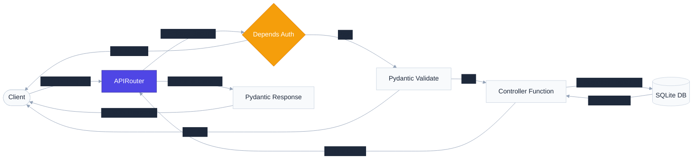

# `app/routes/` — API Endpoint Definitions & Routing Layer

> Maps incoming HTTP requests to their corresponding controller functions, enforces security guards via dependencies, and formats output schemas.

---

## 1. Overview & Purpose

In clean web architecture, the **Routing Layer** acts as the external gateway of the application. Its responsibility is strictly limited to mapping HTTP methods (GET, POST, DELETE, etc.) and URL paths to executable Python code. 

### Why keep routes separate and lightweight?
1. **Zero Business Logic**: Routes should only delegate. If you write SQL or calculations inside a route handler, you mix transport protocols (HTTP) with business rules.
2. **Clear API Contract**: Using FastAPI decorators (`@router.get`, etc.) declaratively defines the request payload (`response_model`), success status code, and tagging for Swagger UI docs.
3. **Guardhouse Security**: Endpoint access rules (authentication and role checks) are declared directly on the route using FastAPI's dependency injection system (`Depends`), keeping controllers clean.

---

## 2. Request Flow & Middleware Gateway

When a request reaches the application, the Routing Layer processes input validation and authorization checks before calling the controller:



---

## 3. Route Specifications & Endpoints

### A. Authentication Router (`auth.py`)
Prefixed with `/auth`, tags: `["Authentication"]`

* **`POST /auth/login`**
  - **Handler**: `login()`
  - **Auth Required**: No (Public)
  - **Inputs**: Form Data (`OAuth2PasswordRequestForm` containing `username` and `password`).
  - **Output**: `TokenResponse` (returns signed JWT `access_token` and `token_type` "bearer").
  - **Description**: Authenticates user credentials against the SQLite database and issues a stateless token.

---

### B. Users Router (`users.py`)
Prefixed with `/users` (implicitly), tags: `["Users"]`

* **`POST /users/register`**
  - **Handler**: `register_user()`
  - **Auth Required**: No (Public)
  - **Inputs**: JSON body `UserCreate` (username, email, password).
  - **Output**: `UserResponse` (id, username, email, role: "customer", is_active).
  - **Description**: Registers a new customer profile. Passwords are encrypted before storing in the database.

* **`POST /users/register-admin`**
  - **Handler**: `register_admin()`
  - **Auth Required**: No (requires registration key validation in controller)
  - **Inputs**: JSON body `AdminRegisterRequest` (username, email, password, `admin_key`).
  - **Output**: `UserResponse` (id, username, email, role: "admin", is_active).
  - **Description**: Registers a new administrator profile. Fails if the provided `admin_key` does not match the configured `ADMIN_REGISTRATION_KEY`.

---

### C. Products Router (`products.py`)
Prefixed with `/products`, tags: `["Products"]`

* **`POST /products`**
  - **Handler**: `create_new_product()`
  - **Auth Required**: **Yes** (`Depends(require_role("admin"))`)
  - **Inputs**: JSON body `ProductCreate` (name, description, category, price, stock_quantity, cost_price).
  - **Output**: `ProductResponse` (filters out `cost_price`).
  - **Description**: Registers a new product. Restricted to admin accounts only.

* **`GET /products`**
  - **Handler**: `get_products()`
  - **Auth Required**: No (Public)
  - **Inputs**: None
  - **Output**: `List[ProductResponse]`
  - **Description**: Returns all catalog products. Publicly viewable for guests.

* **`GET /products/{product_id}`**
  - **Handler**: `get_product()`
  - **Auth Required**: No (Public)
  - **Inputs**: Path parameter `product_id` (integer).
  - **Output**: `ProductResponse`
  - **Description**: Retrieves detailed product details by ID. Raises `ProductNotFoundException` (404) if missing.

* **`DELETE /products/{product_id}`**
  - **Handler**: `delete_existing_product()`
  - **Auth Required**: **Yes** (`Depends(require_role("admin"))`)
  - **Inputs**: Path parameter `product_id` (integer).
  - **Output**: JSON confirmation dict.
  - **Description**: Deletes a product catalog entry. Restricted to admin accounts only.

---

### D. Orders Router (`orders.py`)
Prefixed with `/orders`, tags: `["Orders"]`

* **`POST /orders`**
  - **Handler**: `create_new_order()`
  - **Auth Required**: **Yes** (`Depends(get_current_user)`)
  - **Inputs**: JSON body `OrderCreate` (list of product items and quantities).
  - **Output**: `OrderResponse` (order id, total amount, list of ordered products).
  - **Description**: Places a customer order. Validates stock, calculates pricing, deducts inventory, and records order lines.

* **`GET /orders`**
  - **Handler**: `get_orders()`
  - **Auth Required**: **Yes** (`Depends(get_current_user)`)
  - **Inputs**: None
  - **Output**: `List[OrderResponse]`
  - **Description**: Retrieves a history of all placed orders.

* **`GET /orders/{order_id}`**
  - **Handler**: `get_order()`
  - **Auth Required**: **Yes** (`Depends(get_current_user)`)
  - **Inputs**: Path parameter `order_id` (integer).
  - **Output**: `OrderResponse`
  - **Description**: Retrieves single order details by ID. Raises `OrderNotFoundException` (404) if missing.

---

## 4. Key Patterns: FastAPI Dependency Injection

FastAPI's dependency injection system (`Depends`) executes pre-requisite functions prior to invoking our route handlers. For example:

```python
@router.post("", response_model=ProductResponse, status_code=status.HTTP_201_CREATED)
def create_new_product(
    product: ProductCreate,
    current_user: UserResponse = Depends(require_role("admin"))
):
    return create_product(product)
```

1. **Extraction**: FastAPI identifies `Depends(require_role("admin"))`.
2. **Chain Resolution**: `require_role` returns a helper dependency that demands `Depends(get_current_user)`.
3. **Execution**: FastAPI extracts the Bearer token from the `Authorization` header, decodes and validates the JWT, checks if the user exists and is active in the database.
4. **Authorization check**: The role checker asserts `current_user.role == "admin"`. If false, it raises a `PermissionDeniedException` (which bubbles up to trigger a `403 Forbidden` response).
5. **Route execution**: Only if all checks pass does FastAPI invoke `create_product(product)`.

---

## 5. Real-World Analogy

Think of routes as the **Hospital Wards Reception Desks**:
- **Public Wards (GET /products)**: Anyone can walk in and read the information boards. No security check required.
- **Patient Registration desk (POST /users/register)**: Open to the public, but you must fill out the correct intake form (Pydantic schema).
- **Intensive Care Unit (POST /orders)**: Locked ward. You must present a valid staff/patient wristband (JWT Bearer Token) at the entrance checkpoint (`Depends(get_current_user)`).
- **Medicine Vault (POST /products)**: Only doctors with high-security badges can access. You must present your wristband showing you have the administrative clearance rank (`Depends(require_role("admin"))`).

---

## 6. Interview Questions & Design Takeaways

### 1. What is the difference between Path parameters and Query parameters?
* **Path Parameters** (e.g. `/products/{product_id}`): Used to identify a *specific resource* in the database hierarchy. They are mandatory parts of the URL.
* **Query Parameters** (e.g. `/products?category=electronics&limit=10`): Used to *filter, sort, or paginate* lists of resources. They are optional modifiers appended after the `?`.

### 2. Why shouldn't you put database connections or SQL queries in the route file?
Coupling database drivers and query logic directly in route files violates the **Single Responsibility Principle**. If you ever decide to change your database layer (e.g. migration from raw SQL to an ORM like SQLAlchemy), you would have to modify all your route files. Keeping SQL inside controllers isolates transport protocols (HTTP) from data persistence.

### 3. What happens when a route dependency raises an exception?
If a dependency (like token verification) raises an exception, FastAPI immediately halts execution of the request. The route handler function is never called, preventing unauthorized code execution. The exception bubbles up to the global middleware handlers for translation into a clean error response.

---

## 7. 30-Second Revision

- **Routing Layer** maps requests (URL + Method) to controller handlers.
- **Decorators** declare API metadata (`status_code`, `response_model`, `tags`).
- **Dependencies** (`Depends`) act as reusable pre-execution security guards.
- **Stateless verification** extracts the bearer JWT from headers, validating permissions before running business controller methods.
- **Route handlers** should be clean, single-line wrappers that delegate immediately.
