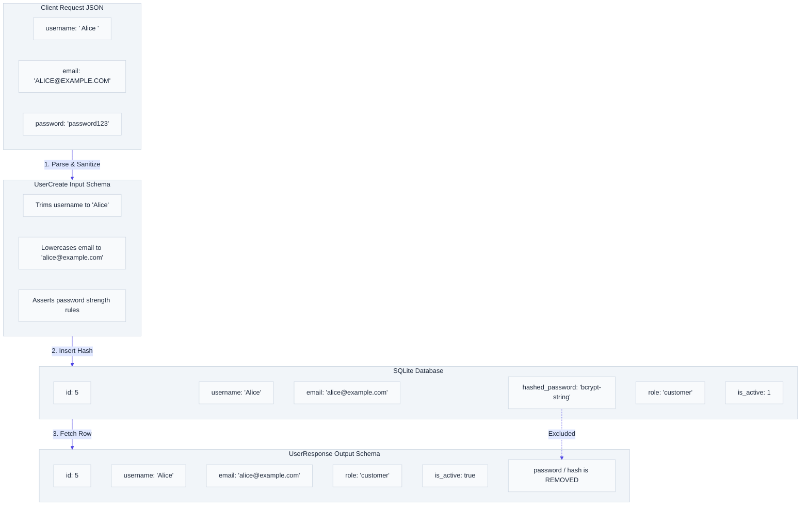

# `app/schemas/` — Data Validation & Serialization Layer

> Powered by Pydantic. Validates and parses incoming request JSON, coerces types, enforces business limits, sanitizes text inputs, and filters outgoing response fields.

---

## 1. Overview & Purpose

In modern backend architecture, the **Schema Layer** defines the strict contract of your API. It serves as the shield protecting your database from bad input and the filter protecting your secrets from leaking to clients.

### Core Responsibilities:
1. **Input Validation**: Ensures that incoming request bodies respect constraints (e.g. lengths, email formatting, values).
2. **Data Sanitization**: Employs `@field_validator` hooks to automatically trim whitespace and lowercase emails, preventing bad data from contaminating database records.
3. **Type Coercion**: Pydantic parses data dynamically. For example, if a client sends `"15"` (string) to an `integer` field, Pydantic converts it to `15` automatically.
4. **Output Serialization**: Determines which database fields are returned to the client, allowing you to exclude internal columns like passwords or cost prices.

---

## 2. Input Validation vs. Response Filtering

The schema layer handles both ends of the request-response cycle, acting as a gateway and a filter:



---

## 3. Files & Schema Definitions

### `product_schema.py`
* **`ProductCreate`**: Input schema for creating products. Enforces name, description, and category validations. Automatically trims name, description, and category. Enforces price and cost price positive bounds.
* **`ProductUpdate`**: Supports partial updates. All fields optional. Sanitizes inputs if provided.
* **`ProductResponse`**: Serializes public output. Excludes `cost_price` to protect profit margins from public endpoints.

---

### `order_schema.py`
* **`OrderItem`**: Enforces `product_id` and `quantity` constraints.
* **`OrderCreate`**: Enforces a list of `items` with at least 1 item (`min_length=1`).
* **`OrderCancelRequest`**: Optional `reason` field for customer cancellations.
* **`OrderStatusUpdate`**: Enforces new status string for admin status transitions.
* **`OrderPackingUpdate`**: Optional `warehouse_notes` text for packaging steps.
* **`PackingChecklist`**: Enforces `all_items_verified` (bool), positive `package_weight` (float), and `package_dimensions` (string) checks.
* **`OrderResponse`**: Formats order receipts, items list, total amounts, and dynamically filters and exposes warehouse notes, checklists, and audit details.

---

### `user_schema.py`
* **`UserCreate`**: Enforces username, email, and password registration constraints. Sanitizes username (whitespace trim & non-empty check) and lowercases email address automatically. Checks password strength rules.
* **`AdminRegisterRequest`**: Inherits `UserCreate`, adds validation for `admin_key`.
* **`WarehouseRegisterRequest`**: Inherits `UserCreate`, used by administrators to securely register warehouse staff.
* **`UserResponse`**: Returns user profile details. Excludes `hashed_password`.
* **`UserUpdate`**: Profile update input. Requires `username` and `email`. Sanitizes strings.
* **`ChangePasswordRequest`**: Password change validation. Validates new password strength.

---

### `internal_schemas.py`
* **`ValidatedOrderItem`**: Internal schema mapping fields populated from database checks during order processing (`product_id`, `quantity`, `unit_price`).

---

## 4. Key Design Patterns: Field Validators

We use Pydantic's `@field_validator` decorator to automatically sanitize and format input fields:
```python
@field_validator("username", mode="before")
@classmethod
def validate_username(cls, v: str) -> str:
    return prevent_empty(strip_whitespace(v))

@field_validator("email", mode="before")
@classmethod
def validate_email(cls, v: str) -> str:
    return lowercase_email(strip_whitespace(v))
```
These validators run in `before` mode, transforming raw request strings into clean, formatted values before Pydantic runs its standard validators, preventing messy inputs from reaching the database.

---

## 5. 30-Second Revision

- **Pydantic** validates input types/constraints and serializes output.
- **`@field_validator`** hooks trim whitespace, lowercase emails, and validate passwords at the API gate.
- **`response_model`** acts as a security filter, hiding columns like cost prices or password hashes.
- **`EmailStr`** validates email syntax structure.
