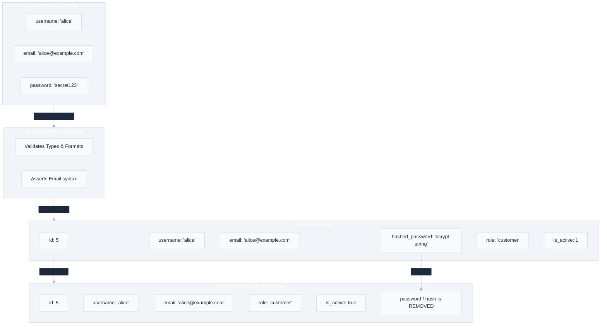

# `app/schemas/` — Data Validation & Serialization Layer

> Powered by Pydantic. Validates and parses incoming request JSON, coerces types, enforces business limits, and filters outgoing response fields.

---

## 1. Overview & Purpose

In modern backend architecture, the **Schema Layer** defines the strict contract of your API. It serves as the shield protecting your database from bad input and the filter protecting your secrets from leaking to clients.

### Core Responsibilities:
1. **Input Validation**: Ensures that incoming request bodies have all required fields, conform to data types, and respect constraints (e.g., minimum lengths, numeric limits, email formatting).
2. **Type Coercion**: Pydantic doesn't just validate; it parses. For example, if a client sends `"15"` (string) to an `integer` field, Pydantic converts it to `15` automatically.
3. **Output Serialization**: Determines which database fields are returned to the client, allowing you to exclude internal columns like passwords or supply-chain margins.
4. **Self-Documenting Code**: FastAPI reads Pydantic schemas to generate OpenAPI documentation (Swagger/ReDoc) automatically.

---

## 2. Input Validation vs. Response Filtering

The schema layer handles both ends of the request-response cycle, acting as a gateway and a filter:

---

## 3. Files & Schema Definitions

### `product_schema.py`
* **`ProductCreate`**: Input schema for creating products. Enforces `name` (3–100 chars), `description` (10–1000 chars), `category` (3–100 chars), `price` (>0 float), `stock_quantity` (>=0 int), and `cost_price` (>0 float). All fields required.
* **`ProductUpdate`**: Supports **partial updates** — every field is `Optional`, defaulting to `None`. The controller reads existing DB values for any `None` field, so clients can send only what they want to change.
* **`ProductResponse`**: Serializes public output. Intentionally **excludes `cost_price`** to protect profit margins from clients.

---

### `order_schema.py`
* **`OrderItem`**: Represents a single item line. Enforces `product_id` (>0) and `quantity` (>0).
* **`OrderCreate`**: Enforces a list of `items` with at least 1 item (`min_length=1`).
* **`OrderResponse`**: Formats order receipts, mapping nested lists of items and order totals.

---

### `user_schema.py`
* **`UserCreate`**: Registration input. Enforces `username` (3–50 chars), `email` (Pydantic `EmailStr` validated), `password` (6–100 chars plain text — hashed before DB storage).
* **`AdminRegisterRequest`**: Inherits all `UserCreate` fields, adds `admin_key` (min 5 chars) for administrative registration gate-keeping.
* **`UserResponse`**: Public profile output returning `id`, `username`, `email`, `role`, and `is_active`. Completely excludes `hashed_password` and `created_at`.
* **`UserUpdate`**: Profile update input. Requires both `username` (3–50 chars) and `email` — neither is optional (both must be provided together).
* **`ChangePasswordRequest`**: Password change input. Requires `old_password` (6–100 chars, current) and `new_password` (6–100 chars, desired). The controller bcrypt-verifies `old_password` before applying the change.

---

### `auth_schema.py`
* **`LoginRequest`**: Validates email and password parameters.
* **`TokenResponse`**: Returns OAuth2-compliant token payload (`access_token` and `token_type` values).
* **`TokenPayload`**: Internal schema mapping fields decoded from the JWT payload (`sub` and `role`).

---

### `internal_schemas.py`
* **`ValidatedOrderItem`**: An internal database model (`product_id`, `quantity`, `unit_price`). 
* **Design Decision**: Why separate this from public schemas? During order placement, customers only send product IDs and quantities (they cannot supply unit prices, otherwise they could manipulate pricing). Once the controller queries the database and fetches the real prices, it packs them into a `ValidatedOrderItem` list, ensuring type safety *within* our database routines without polluting public API schema definitions.

---

## 4. Real-World Analogy

Think of schemas as the **Intake Forms at a secure warehouse**:
- **The Input Form (UserCreate)**: You are registering an employee. You fill out an intake card with a name, email, and password. If you miss a field or enter a bad format, the receptionist rejects the form immediately (`422 Unprocessable Entity`).
- **The File Cabinet (Database)**: The warehouse database stores the name, email, and a hashed version of the password.
- **The Directory Form (UserResponse)**: A public directory listing is printed. It prints the employee's ID, username, and role, but hides the password hash. Security Margins are maintained.

---

## 5. Interview Questions & Tips

### 1. What is the difference between parsing and validating in Pydantic?
Traditional validation checks if values are correct (returning True/False). Pydantic **parses** data, converting unstructured JSON dictionary inputs into structured Python class objects. It enforces types dynamically: if a string `"100"` is sent to a float field, Pydantic converts it to `100.0` rather than raising a type error.

### 2. Why should we avoid returning raw database dictionaries or SQLite Row objects directly from routes?
Returning raw database rows directly couples your database column structure to your API responses. If a developer renames a database column (e.g. `is_active` to `status`), the API contract breaks for clients. Using a Pydantic `response_model` decouples the database structure from the API format. Furthermore, raw database rows can cause leakage of sensitive columns (such as password hashes or margins).

### 3. How does `EmailStr` work in Pydantic?
`EmailStr` leverages the `email-validator` package under the hood. It asserts that the value matches standard email syntax (e.g. `user@domain.com`). It does not verify if the inbox exists, but checks syntax, domain validity, and normalizes characters.

---

## 6. 30-Second Revision

- **Pydantic** validates input types/constraints and serializes output.
- **Type Coercion** converts incoming values to their declared types dynamically.
- **`response_model`** acts as a security filter, hiding columns like cost prices or password hashes.
- **`EmailStr`** validates email syntax structure.
- **Internal Schemas** keep controller-internal models typed without exposing them to public Swagger specifications.
