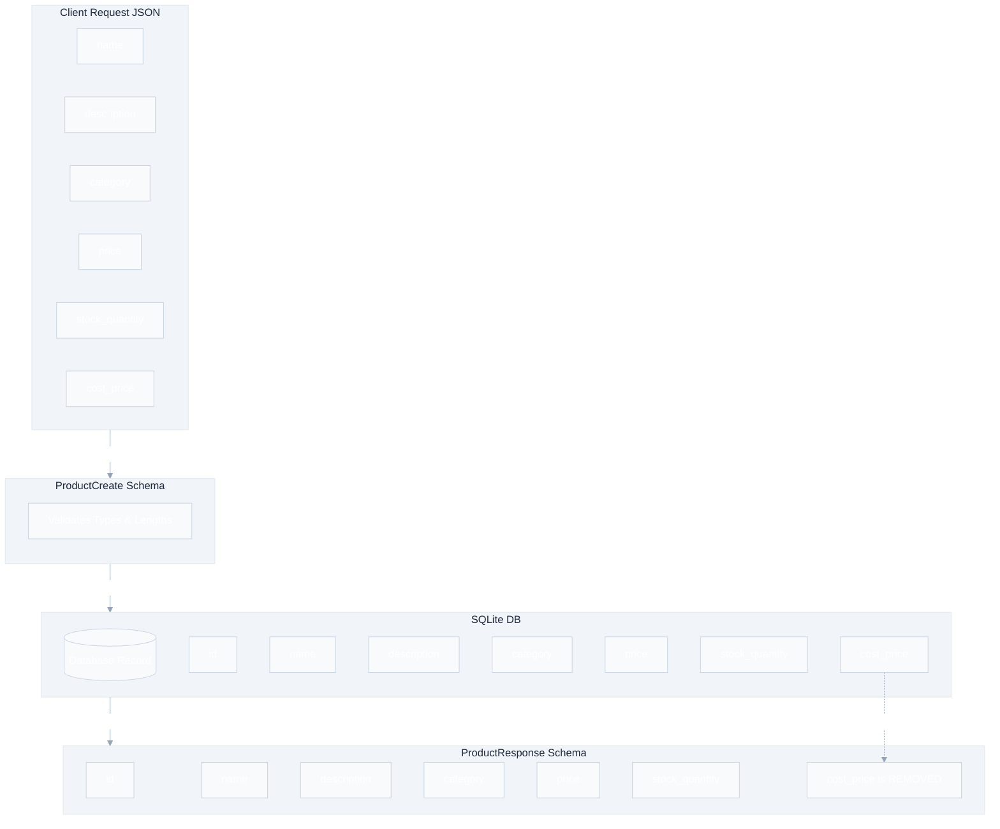
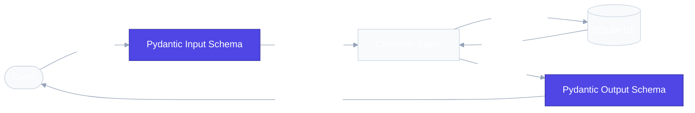

# `app/schemas/` — Data Validation Layer

> Pydantic models that validate every request before your code runs and filter every response before it leaves the server.

## Why Schemas Matter

Without schemas, you'd write manual `if/else` checks for every field of every incoming request. Pydantic does this automatically — and generates Swagger documentation from the same definitions.

## Files

### `product_schema.py`

| Schema | Purpose | Key Fields |
|---|---|---|
| `ProductCreate` | Validates input for creating a product | `name` (3-100 chars), `price` (>0), `cost_price` (>0) |
| `ProductUpdate` | Validates partial updates (all fields optional) | Same fields as Create, but `Optional` |
| `ProductResponse` | Filters output — hides `cost_price` | `id`, `name`, `description`, `category`, `price`, `stock_quantity` |

### `order_schema.py`

| Schema | Purpose | Key Fields |
|---|---|---|
| `OrderItem` | Represents one product in an order | `product_id` (>0), `quantity` (>0) |
| `OrderCreate` | Validates a new order with multiple items | `items` (List[OrderItem], min 1 item) |
| `OrderResponse` | Returns order details to the client | `id`, `total_amount`, `items` |

### `internal_schemas.py`

Contains internal Pydantic models used inside controllers and services to pass structured data between application layers without exposing them to public API clients.

| Schema | Purpose | Key Fields |
|---|---|---|
| `ValidatedOrderItem` | Stores resolved product details (including unit price) after database validation in `create_order` | `product_id`, `quantity`, `unit_price` |

> [!NOTE]
> **Internal vs. Public Schemas**:
> Public API models (like `OrderItem`) only contain inputs provided by clients (e.g. they don't supply prices to prevent price manipulation). `ValidatedOrderItem` is constructed internally by the controller after fetching prices from the database, allowing us to maintain strict type safety when passing validated item lists around.

## The Input ≠ Output Pattern

This is a critical security pattern:

> [!IMPORTANT]
> The response schema acts as a security filter. `cost_price` is stored in the database but never exposed to API consumers. This is how real companies protect internal pricing data.

## Request Flow

## Real-World Analogy

Schemas = **Application forms**. They specify required fields, data types, and rules. If the form is filled incorrectly, the receptionist rejects it immediately. The manager (controller) never sees invalid data.

## Best Practices

**Do:** Use `Field(gt=0)` constraints. Document fields with `description=`. Keep input and output schemas separate.

**Don't:** Include sensitive fields in Response schemas. Don't put business logic in validators.

## 30-Second Revision

- Schemas validate requests (input) and filter responses (output)
- Internal schemas (in `internal_schemas.py`) handle structured data validation between internal components/controllers without being exposed to clients
- Pydantic auto-returns `422 Unprocessable Entity` for validation failures
- Response schemas hide internal fields like `cost_price` from API consumers
- `Field(...)` means required, `Field(None)` means optional
- `gt=0` means greater than zero, `min_length=3` means at least 3 characters
