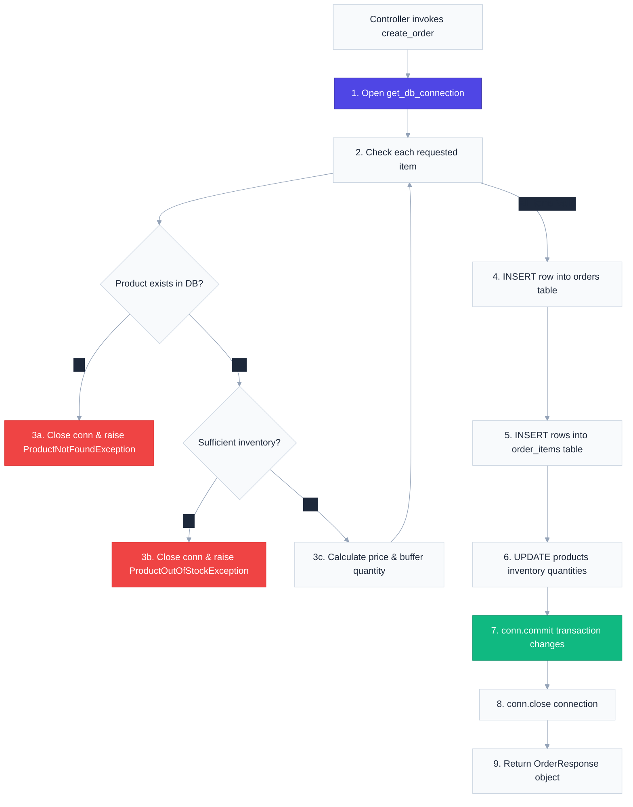

# `app/services/` — Business Logic & Services Layer

> Where the core application business rules and database query operations live. Services execute SQL statements, manage SQLite transactions, apply validation logic, and return standard models.

---

## 1. Overview & Purpose

In clean web architecture, the **Service Layer** represents the core brain of the application. It acts as a bridge between the HTTP-aware controllers and the raw database tables.

### Core Design Principles:
1. **HTTP Agnostic**: Services have no knowledge of FastAPI routes, JSON responses, or status codes. They take clean python parameters or models, run database transactions, and return raw python data or Pydantic models. This allows reusing services in background tasks or CLI scripts.
2. **Database Resource Management**: Services are responsible for opening SQLite connections (`get_db_connection()`), executing statements, and closing connections to prevent file locks.
3. **Transaction Integrity**: Services group related database updates together and commit them atomically (`conn.commit()`). If any update fails, the transaction is automatically rolled back, protecting data integrity.

---

## 2. Business Flow & Database Transactions

Below is the database execution path orchestrated inside `order_service.py` during order creation:



---

## 3. Files & Specifications

### `product_service.py`
Executes SQL queries for catalog operations:
* **`create_product(product: ProductCreate) -> ProductResponse`**: Hashes data and INSERTs it into the products table, returning a structured product response.
* **`get_all_products() -> List[ProductResponse]`**: SELECTs all rows from the products table.
* **`get_product_by_id(product_id: int) -> ProductResponse`**: Retrieves a single product or raises `ProductNotFoundException`.
* **`update_product(product_id: int, product: ProductUpdate) -> ProductResponse`**: Performs partial SQL updates on products, keeping existing database values for empty fields.
* **`delete_product(product_id: int)`**: DELETEs the product row from the database.

---

### `order_service.py`
Manages atomic order operations:
* **`create_order(order: OrderCreate, current_user: UserResponse) -> OrderResponse`**: Runs stock checks and calculates totals. Then updates the `orders`, `order_items`, and `products` tables inside a transaction block.
* **`get_all_orders() -> List[OrderResponse]`**: Performs nested SQL queries to fetch all orders with their order items.
* **`get_order_by_id(order_id: int) -> OrderResponse`**: Fetches details for a single order by ID.

---

### `user_service.py`
Executes user profile operations:
* **`create_user(user: UserCreate) -> UserResponse`**: Hashes the password and INSERTs the user with a `customer` role.
* **`create_admin(admin: AdminRegisterRequest) -> UserResponse`**: Validates the admin registration key and INSERTs the admin user.
* **`update_current_user(...)`**: Performs UPDATE statements on user fields.
* **`change_password(...)`**: Validates the existing password hash using bcrypt and saves the new password hash.

---

### `auth_service.py`
* **`login_user(form_data: OAuth2PasswordRequestForm) -> dict`**: Validates user credentials, verifies the password hash, and creates a JWT access token using the `jwt.py` utility.

---

## 4. Key Design Patterns: Connection Resource Safety

To prevent database locking issues in SQLite, services follow a strict resource closing pattern:
```python
conn = get_db_connection()
cursor = conn.cursor()
try:
    # Execute SQL updates
    conn.commit()
except Exception as e:
    # Handle or log error
    raise e
finally:
    # Always ensure connection is closed!
    conn.close()
```
If an exception is raised, the connection is closed immediately inside the `finally` block or right before the exception is raised, freeing the SQLite database file for other connections.
